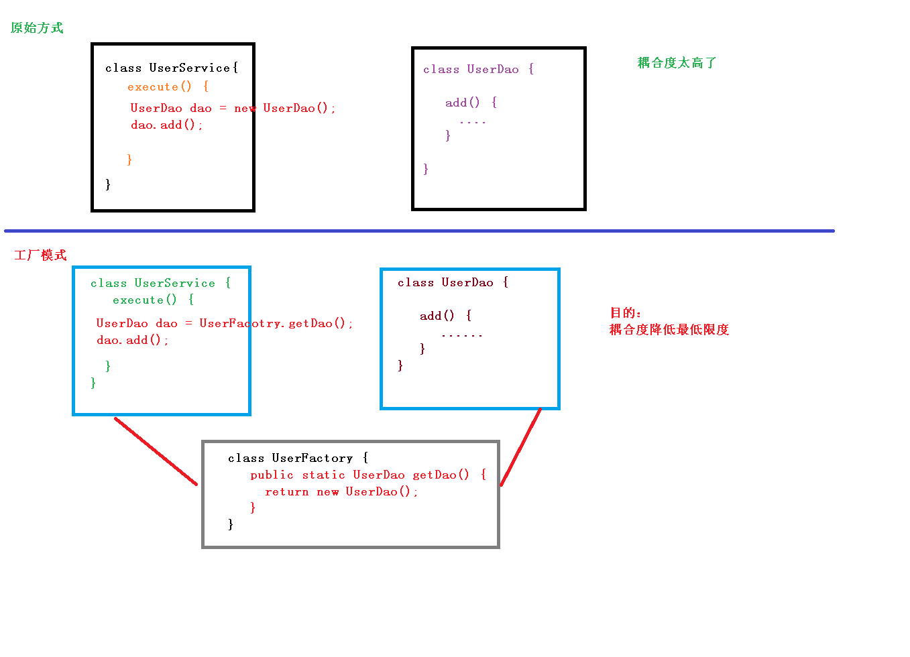
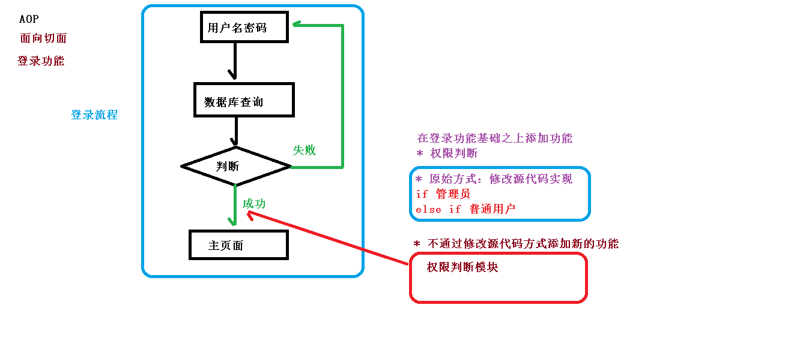

> 该系列来源于尚硅谷教程


# Spring概述(一)


Spring框架是一个开放源代码的J2EE应用程序框架，由Rod Johnson发起，是针对bean的生命周期进行管理的轻量级容器（lightweight container）。 Spring解决了开发者在J2EE开发中遇到的许多常见的问题，提供了功能强大IOC、AOP及Web MVC等功能。Spring可以单独应用于构筑应用程序，也可以和Struts、Webwork、Tapestry等众多Web框架组合使用，并且可以与 Swing等桌面应用程序AP组合。因此， Spring不仅仅能应用于J2EE应用程序之中，也可以应用于桌面应用程序以及小应用程序之中。Spring框架主要由七部分组成，分别是 Spring Core、 Spring AOP、 Spring ORM、 Spring DAO、Spring Context、 Spring Web和 Spring Web MVC。


## Spring5框架概述
1、Spring是轻量级的开源的JavaEE框架
2、Spring可以解决企业应用开发的复杂性
3、Spring有两个核心部分：IOC和Aop
(1)IOC:控制反转，把创建对象过程交给Spring进行管理
(2)Aop:面向切面，不修改源代码进行功能增强
4、Spring特点
(1)方便解耦，简化开发
(2)Aop编程支持
(3)方便程序测试
(4)方便和其他框架进行整合
(5)方便进行事务操作
(6)降低API开发难度


# 入门案例和jar包下载(二)


官网：https://spring.io/projects/spring-framework#overview

GA：General Availability,正式发布的版本，官方推荐使用此版本。在国外都是用GA来说明release版本的。
SNAPSHOT：快照版，可以稳定使用，且仍在继续改进版本。
PRE：预览版,内部测试版. 主要是给开发人员和测试人员测试和找BUG用的，不建议使用；

jar下载地址：https://repo.spring.io/ui/native/release/org/springframework/spring/

下载使用spring-5.2.6.RELEASE版本

## Spring5模块
[](https://blog.lijiajia.top/wp-content/uploads/2022/04/Spring5模块.bmp)


## 入门创建对象案例
不通过new对象，通过spring创建对象

不使用maven，手动添加jar包
spring-beans-5.2.6.RELEASE.jar
spring-context-5.2.6.RELEASE.jar
spring-core-5.2.6.RELEASE.jar
spring-expression-5.2.6.RELEASE.jar
其他：
commons-logging-1.1.1.jar
junit4
### xml文件
```xml
<?xml version="1.0" encoding="UTF-8"?>
<beans xmlns="http://www.springframework.org/schema/beans"
       xmlns:xsi="http://www.w3.org/2001/XMLSchema-instance"
       xsi:schemaLocation="http://www.springframework.org/schema/beans http://www.springframework.org/schema/beans/spring-beans.xsd">

    <!--配置User对象创建-->
    <bean id="user" class="com.spring5.User"></bean>
</beans>
```
## class类
```java
package com.spring5;

public class User {

    public void add(){
        System.out.println("add ...");
    }
}

```

## junit测试类执行
```java
package com.spring5.testdemo;

import com.spring5.User;
import org.junit.Test;
import org.springframework.context.ApplicationContext;
import org.springframework.context.support.ClassPathXmlApplicationContext;

public class TestSpring5 {


    @Test
    public void testAdd(){
        //1.加载spring配置文件
        ApplicationContext context = new ClassPathXmlApplicationContext("bean1.xml");
        //2.获取配置创建的对象
        User user = context.getBean("user", User.class);

        System.out.println(user);

        user.add();
    }
}

```

## 执行结果
```java
com.spring5.User@1a3869f4
add ...
```


# IOC的概念和原理(三)


## 1、什么是IOC
(1)控制反转，把对象创建和对象之间的调用过程，交给Spring进行管理
(2)使用IOC目的：为了耦合度降低
(3)做入门案例就是IOC实现
## 2、IOC底层原理
(1)xml解析、工厂模式、反射

## 3.图解IOC底层原理
### 演变过程
原始方式和工厂模式：创建对象


IOC创建对象实现方式
通过xml解析、工厂模式、反射


## 4.IOC(BeanFactory接口)
1、IOC思想基于IOC容器完成，IOC容器底层就是对象工厂
2、Spring提供IOC容器实现两种方式：（两个接口）
(1)BeanFactory:IOC容器基本实现，是Spring内部的使用接口，不提供开发人员进行使用
*加载配置文件时候不会创建对象，在获取对象（使用）才去创建对象
(2)ApplicationContext:BeanFactory接口的子接口，提供更多更强大的功能，一般由开发人员进行使用
*加载配置文件时候就会把在配置文件对象进行创建


## 5.ApplicationContext接口有实现类


# IOC操作Bean管理-对象创建和属性赋值(四)


## IOC操作Bean管理（概念）

1）、什么是Bean管理
Bean管理指的是两个操作
(1)Spring创建对象
(2)Spirng注入属性

2）、Bean管理操作有两种方式
(1)基于xml配置文件方式实现
(2)基于注解方式实现

## IOC操作Bean管理（基于xml方式）
### 一：对象创建
```java
<!--配置User对象创建-->
    <bean id="user" class="com.spring5.User"></bean>
```
(1)在spring配置文件中，使用bean标签，标签里面添加对应属性，就可以实现对象创建
(2)在bean标签有很多属性，介绍常用的属性：
*id 属性：唯一标识，别名
*class 属性：类全路径（包类路径）
(3)创建对象时候，默认也是执行**无参数构造**方法完成对象创建

### 二：基于xml方式注入属性
DI（Dependency Injection）:依赖注入，就是注入属性

spring两种注入方式：
#### 1.第一种方式，set方法进行注入
```java
public class Book {
    //创建属性
    private String bname;
    private String bauthor;

    //创建属性对应的set方法注入
    public void setBname(String bname) {
        this.bname = bname;
    }

    public void setBauthor(String bauthor) {
        this.bauthor = bauthor;
    }
    @Override
    public String toString() {
        return "Book{" +
                "bname='" + bname + '\'' +
                ", bauthor='" + bauthor + '\'' +
                '}';
    }
}
```
```xml
<!--set方法注入属性-->
    <bean id="book" class="com.spring5.Book">
        <!--使用property完成属性注入
            name： 类里面属性名称
            value： 向属性注入的值-->
        <property name="bname" value="时间简史"></property>
        <property name="bauthor" value="霍金"></property>
    </bean>
```

junit测试：
```java
@Test
    public void testSetMethod(){
        ApplicationContext ac = new ClassPathXmlApplicationContext("bean1.xml");
        Book book = ac.getBean("book", Book.class);
        System.out.println(book.toString());
    }
```
测试结果：
```java
Book{bname='时间简史', bauthor='霍金'}
```
#### 2.第二种方式，有参数构造进行注入
```java
public class Orders {
    //属性
    private String oname;
    private String address;
    //有参构造
    public Orders(String oname, String address) {
        this.oname = oname;
        this.address = address;
    }

    @Override
    public String toString() {
        return "Orders{" +
                "oname='" + oname + '\'' +
                ", address='" + address + '\'' +
                '}';
    }
}
```
```xml
<!--有参构造注入属性-->
    <bean id="orders" class="com.spring5.Orders">
        <constructor-arg name="oname" value="手机"></constructor-arg>
        <constructor-arg name="address" value="中国"></constructor-arg>
        <!--还可以通过index 顺序设置值-->
        <!--<constructor-arg index="0" value=""></constructor-arg>-->
    </bean>
```

junit测试：
```java
@Test
    public void testConstructor(){
        ApplicationContext applicationContext = new ClassPathXmlApplicationContext("bean1.xml");
        Orders orders = applicationContext.getBean("orders", Orders.class);
        System.out.println(orders);
    }
```

测试结果：
```java
Orders{oname='手机', address='中国'}
```

#### 3.set方法另一种注入方式，p名称空间注入
添加p名称空间
```xml
<beans xmlns="http://www.springframework.org/schema/beans"
       xmlns:xsi="http://www.w3.org/2001/XMLSchema-instance"
       xmlns:p="http://www.springframework.org/schema/p"
       xsi:schemaLocation="http://www.springframework.org/schema/beans http://www.springframework.org/schema/beans/spring-beans.xsd">
```
属性注入
```xml
<!--p名称空间注入-底层还是set注入-->
    <bean id="book" class="com.spring5.Book" p:bname="百年孤独" p:bauthor="加西亚">
    </bean>
```

#### 字面量
（1）null值
```java
<!--null值-->
        <property name="address">
            <null/>
        </property>
```
（2)属性包含特殊符号
```java
<!--属性值包含特色符号
            1.转义 < >
            2.CDATA-->
        <property name="address">
            <value>
                <![CDATA[<<上海>>]]>
            </value>
        </property>
```

#### 注入属性-外部bean
(1)创建两个类service类和dao类
(2)在service调用dao里面的方法
```java
public class UserService {

//    创建UserDao类型属性 生成set方法
    private UserDao userDao;

    public void setUserDao(UserDao userDao) {
        this.userDao = userDao;
    }

    public void add(){
        System.out.println("service add .....");
        userDao.update();
        //原始方式
//        UserDao userDao = new UserDaoImpl();
//        userDao.update();
    }
}
```

```java
public interface UserDao {
    public void update();
}
```

```java
public class UserDaoImpl implements UserDao {

    @Override
    public void update() {
        System.out.println("dao update.......");
    }
}
```

(3)在spring配置文件中进行配置

```xml
<!--1. service和dao对象创建-->
    <bean id="userService" class="com.spring5.service.UserService">
        <!--注入userDao对象
            name属性：类里面属性名称
            ref属性：创建userDao对象bean标签id值-->
        <property name="userDao" ref="userDao"></property>
    </bean>

    <!--userDao 是接口，class 找它的实现类-->
    <bean id="userDao" class="com.spring5.dao.UserDaoImpl"></bean>
```


#### 注入属性-内部bean
(1)一对多关系：部门和员工
一个部门有多个员工，一个员工属于一个部门
部门是一，员工是多
(2)在实体类之间表示一对多关系，员工表示所属部门，使用对象类型属性进行表示
```java
//部门类
public class Dept {

    private String dname;

    public void setDname(String dname) {
        this.dname = dname;
    }

    @Override
    public String toString() {
        return "Dept{" +
                "dname='" + dname + '\'' +
                '}';
    }
}
```

```java
//员工类
public class Emp {

    private String ename;
    private String gender;

    //员工属于某一个部门
    private Dept dept;

    public void setDept(Dept dept) {
        this.dept = dept;
    }

    public void setEname(String ename) {
        this.ename = ename;
    }

    public void setGender(String gender) {
        this.gender = gender;
    }


    @Override
    public String toString() {
        return "Emp{" +
                "ename='" + ename + '\'' +
                ", gender='" + gender + '\'' +
                ", dept=" + dept +
                '}';
    }
}
```
(3)spring配置文件
```xml
<!--内部bean-->
    <bean id="emp" class="com.spring5.bean.Emp">
        <!--普通属性-->
        <property name="ename" value="Tom"></property>
        <property name="gender" value="男"></property>
        <!--设置对象类型属性-->
        <property name="dept">
            <bean id="dept" class="com.spring5.bean.Dept">
                <property name="dname" value="客服部"></property>
            </bean>
        </property>
    </bean>
```

(4)junit测试
```java
@Test
    public void test2(){
        ApplicationContext applicationContext = new ClassPathXmlApplicationContext("bean3.xml");
        Emp emp = applicationContext.getBean("emp", Emp.class);
        System.out.println(emp.toString());
    }
```
测试结果
```java
Emp{ename='Tom', gender='男', dept=Dept{dname='客服部'}}
```
#### 注入属性-级联赋值
第一种方式：
```xml
<!--级联赋值-->
    <bean id="emp" class="com.spring5.bean.Emp">
        <!--普通属性-->
        <property name="ename" value="Tom"></property>
        <property name="gender" value="男"></property>
        <!--设置对象类型属性-->
        <property name="dept" ref="dept"></property>
    </bean>

    <bean id="dept" class="com.spring5.bean.Dept">
        <property name="dname" value="客服部"></property>
    </bean>
```
第二种方式
```java
  //员工属于某一个部门
    private Dept dept;
    //级联赋值需要get方法
    public Dept getDept() {
        return dept;
    }
```
```xml
    <!--级联赋值-->
    <bean id="emp" class="com.spring5.bean.Emp">
        <!--普通属性-->
        <property name="ename" value="Tom"></property>
        <property name="gender" value="男"></property>
        <!--设置对象类型属性-->
        <property name="dept" ref="dept"></property>
        <property name="dept.dname" value="技术部"></property>
    </bean>

    <bean id="dept" class="com.spring5.bean.Dept">
<!--        <property name="dname" value="客服部"></property>-->
    </bean>
```


#### xml注入集合属性
（1）注入数组类型属性
（2）注入List集合类型属性
（3）注入Map集合类型属性
```java
public class Stu {

    //1 数组类型属性
    private String[] courses;

    //2 list集合类型属性
    private List<String> list;

    // 3 Map类型属性
    private Map<String,String> map;

    //3 Set 类型属性
    private Set<String> sets;

    public void setCourses(String[] courses) {
        this.courses = courses;
    }

    public void setList(List<String> list) {
        this.list = list;
    }

    public void setMap(Map<String, String> map) {
        this.map = map;
    }

    public void setSets(Set<String> sets) {
        this.sets = sets;
    }

    @Override
    public String toString() {
        return "Stu{" +
                "courses=" + Arrays.toString(courses) +
                ", list=" + list +
                ", map=" + map +
                ", sets=" + sets +
                '}';
    }
}
```

```xml
    <!--集合类型属性注入-->
    <bean id="stu" class="com.spring5.collectiontype.Stu">
        <!--数组类型属性注入-->
        <property name="courses" >
            <!--可以使用list或者array标签-->
           <!-- <list></list>-->
            <array>
                <value>数学</value>
                <value>应用</value>
            </array>
        </property>

        <!--list类型属性注入-->
        <property name="list">
            <list>
                <value>张三</value>
                <value>李四</value>
            </list>
        </property>

        <!--map类型属性注入-->
        <property name="map">
            <map>
                <entry key="JAVA" value="java"></entry>
                <entry key="PHP" value="php"></entry>
            </map>
        </property>

        <!--set类型属性注入-->
        <property name="sets">
            <set>
                <value>MySQL</value>
                <value>Redis</value>
            </set>
        </property>
    </bean>
```

junit测试
```java
@Test
    public void testCollection(){

        ApplicationContext applicationContext = new ClassPathXmlApplicationContext("bean1.xml");
        Stu stu = applicationContext.getBean("stu", Stu.class);

        System.out.println(stu.toString());
    }
```
测试结果
```java
Stu{courses=[数学, 应用], list=[张三, 李四], map={JAVA=java, PHP=php}, sets=[MySQL, Redis]}
```

#### 细节一：在集合里面设置对象属性值
```java
//课程类
public class Course {

    private String cname;

    public void setCname(String cname) {
        this.cname = cname;
    }

    @Override
    public String toString() {
        return "Course{" +
                "cname='" + cname + '\'' +
                '}';
    }
}
```

Stu类添加：
```java
//学生所学多门课程
   private List<Course> courseList;
    public void setCourseList(List<Course> courseList) {
        this.courseList = courseList;
    }
```

要注入的对象
```xml
<bean id="course1" class="com.spring5.collectiontype.Course">
        <property name="cname" value="数学"></property>
    </bean>
    <bean id="course2" class="com.spring5.collectiontype.Course">
        <property name="cname" value="美术"></property>
    </bean>
```
对象属性注入
```xml
<!--注入list类型 值是对象-->
        <property name="courseList">
            <list>
                <ref bean="course1"></ref>
                <ref bean="course2"></ref>
            </list>
        </property>
```
#### 细节二：把集合注入公共部分提取出来
Book类：
```java
public class Book {

    private List<String> list;

    public void setList(List<String> list) {
        this.list = list;
    }

    @Override
    public String toString() {
        return "Book{" +
                "list=" + list +
                '}';
    }
}
```

添加util名称空间：
```xml
<beans xmlns="http://www.springframework.org/schema/beans"
       xmlns:xsi="http://www.w3.org/2001/XMLSchema-instance"
       xmlns:p="http://www.springframework.org/schema/p"
       xmlns:util="http://www.springframework.org/schema/util"
       xsi:schemaLocation="http://www.springframework.org/schema/beans http://www.springframework.org/schema/beans/spring-beans.xsd
                           http://www.springframework.org/schema/util http://www.springframework.org/schema/util/spring-util.xsd">

```
设置公共部分属性值：
```xml
<!--1. 提取list集合类型属性-->
    <util:list id="bookList">
        <!--对象-->
        <!-- <ref></ref>-->
        <value>语文书</value>
        <value>数学书</value>
        <value>英语书</value>
    </util:list>

    <!--2.提取的公共部分 注入使用-->
    <bean id="book" class="com.spring5.collectiontype.Book">
        <property name="list" ref="bookList"></property>
    </bean>
```

junit测试：
```java
 @Test
    public void testCollection2(){

        ApplicationContext applicationContext = new ClassPathXmlApplicationContext("bean2.xml");
        Book book = applicationContext.getBean("book", Book.class);

        System.out.println(book.toString());
    }
```
测试结果：
```java
Book{list=[语文书, 数学书, 英语书]}
```


# IOC操作Bean管理-FactoryBean(五)


1、Spring有两种类型bean,一种普通bean,另外一种工厂bean(FactoryBean)
2、普通bean:在配置文件中定义bean类型就是返回类型
3、工厂bean:在配置文件定义bean类型可以和返回类型不一样
第一步创建类，让这个类作为工厂bean,实现接口FactoryBean
第二步实现接口里面的方法，在实现的方法中定义返回的bean类型

## FactoryBean的代码
MyBean:
```java
public class Mybean implements FactoryBean<Book> {

    //返回的对象-可以通过反射修改返回对象
    @Override
    public Book getObject() throws Exception {
        //伪代码
        Book book = new Book();
        List<String> lists = new ArrayList<>();
        lists.add("百年孤独");
        book.setList(lists);
        return book;
    }

    @Override
    public Class<?> getObjectType() {
        return null;
    }

    @Override
    public boolean isSingleton() {
        return FactoryBean.super.isSingleton();
    }
}
```

```xml
<bean id="myBean" class="com.spring5.factorybean.Mybean"></bean>
```

junit测试：
```java
@Test
    public void test3(){

        ApplicationContext applicationContext = new ClassPathXmlApplicationContext("bean3.xml");
        Book myBean = applicationContext.getBean("myBean", Book.class);

        System.out.println(myBean);
    }
```
测试结果：
```java
Book{list=[百年孤独]}
```


# IOC操作Bean管理-Bean的作用域(六)


## 作用域scope：
| 作用域      | 描述                                                         |
| ----------- | ------------------------------------------------------------ |
| singleton   | 在spring IoC容器仅存在一个Bean实例，Bean以单例方式存在，bean作用域范围的默认值。 |
| prototype   | 每次从容器中调用Bean时，都返回一个新的实例，即每次调用getBean()时，相当于执行newXxxBean()。 |
| request     | 每次HTTP请求都会创建一个新的Bean，该作用域仅适用于web的Spring WebApplicationContext环境。 |
| session     | 同一个HTTP Session共享一个Bean，不同Session使用不同的Bean。该作用域仅适用于web的Spring WebApplicationContext环境。 |
| application | 限定一个Bean的作用域为ServletContext的生命周期。该作用域仅适用于web的Spring WebApplicationContext环境。 |

## 代码实现设置多实例：
```java
<bean id="book" class="com.spring5.collectiontype.Book" scope="prototype">
        <property name="list" ref="bookList"></property>
    </bean>
```
执行结果，对象不一致：
```java
com.spring5.collectiontype.Book@4b53f538
com.spring5.collectiontype.Book@134593bf
```
1、在Spring里面，可以设置创建的bean实例是单实例还是多实例

2、在Spring里面，默认情况下，bean是单实例对象

## singleton和prototype区别
第一：singleton单实例，prototype多实例
第二：设置scope值是singleton时候，加载spring配置文件时候就会创建单实例对象
设置scope值是prototype时候，不是在加载spring配置文件时候创建对象，在调用getBean方法时候创建多实例对象


# IOC操作Bean管理-Bean的生命周期(七)


Spring Bean 的实例化过程：https://mp.weixin.qq.com/s/v3eWiHIbAUOcHd5N5D4nuA

## 1、生命周期
(1)从对象创建到对象销毁的过程
## 2、bean生命周期
(1)通过构造器创建bean实例（无参数构造）
(2)为bean的属性设置值和对其他bean引用（调用set方法）
(3)调用bean的初始化的方法（需要进行配置初始化的方法）
(4)bean可以使用了（对象获取到了）
(5)当容器关闭时候，调用bean的销毁的方法（需要进行配置销毁的方法）

```java
public class Orders {

    //无参数构造
    public Orders() {
        System.out.println("第一步 执行无参数构造创建bean实例");
    }

    private String oname;

    public void setOname(String oname) {
        this.oname = oname;
        System.out.println("第二步 调用set方法设置属性值");
    }


    public void initMethod(){
        System.out.println("第三步 执行初始化方法");
    }
    public void destroyMethod(){
        System.out.println("第五步 执行销毁方法");
    }

}
```

```xml
<bean id="orders" class="com.spring5.bean.Orders" init-method="initMethod" destroy-method="destroyMethod">
        <property name="oname" value="手机"></property>
    </bean>
```

junit测试：
```java
  @Test
    public void test4(){
//        ApplicationContext applicationContext = new ClassPathXmlApplicationContext("bean4.xml");
        ClassPathXmlApplicationContext applicationContext = new ClassPathXmlApplicationContext("bean4.xml");
        Orders orders = applicationContext.getBean("orders", Orders.class);
        System.out.println("第四步 获取创建的bean实例对象");
        System.out.println(orders);

        //手动让bean实例销毁
        applicationContext.close();
    }
```
执行结果：
```java
第一步 执行无参数构造创建bean实例
第二步 调用set方法设置属性值
第三步 执行初始化方法
第四步 获取创建的bean实例对象
com.spring5.bean.Orders@396e2f39
第五步 执行销毁方法
```

## 4、bean的后置处理器，bean生命周期有七步
当配置后置处理bean，会在bean初始化前后执行的方法，不配置，不执行
(1)通过构造器创建bean实例（无参数构造）
(2)为bean的属性设置值和对其他bean引用（调用set方法）
(3)把bean实例传递bean后置处理器的方法postProcessBeforeInitialization
(4)调用bean的初始化的方法（需要进行配置初始化的方法）
(5)把bean实例传递bean后置处理器的方法postProcessAfterInitialization
(6)bean可以使用了（对象获取到了）
(7)当容器关闭时候，调用bean的销毁的方法（需要进行配置销毁的方法）

实现BeanPostProcessor接口，创建后置处理器
```java
public class MyBeanPost implements BeanPostProcessor {

    @Override
    public Object postProcessBeforeInitialization(Object bean, String beanName) throws BeansException {
        System.out.println("在初始化执行之前 执行的方法");
        return bean;
    }

    @Override
    public Object postProcessAfterInitialization(Object bean, String beanName) throws BeansException {
        System.out.println("在初始化执行之后 执行的方法");
        return bean;
    }

}
```
```xml
<bean id="orders" class="com.spring5.bean.Orders" init-method="initMethod" destroy-method="destroyMethod">
        <property name="oname" value="手机"></property>
    </bean>
    <!--本xml的bean初始化前后都会执行的后置处理器-->
    <bean id="beanPost" class="com.spring5.bean.MyBeanPost"></bean>
```
junit测试：
```java
 @Test
    public void test4(){
//        ApplicationContext applicationContext = new ClassPathXmlApplicationContext("bean4.xml");
        ClassPathXmlApplicationContext applicationContext = new ClassPathXmlApplicationContext("bean4.xml");
        Orders orders = applicationContext.getBean("orders", Orders.class);
        System.out.println("第四步 获取创建的bean实例对象");
        System.out.println(orders);

        //手动让bean实例销毁
        applicationContext.close();
    }
```
执行结果
```java
第一步 执行无参数构造创建bean实例
第二步 调用set方法设置属性值
在初始化执行之前 执行的方法
第三步 执行初始化方法
在初始化执行之后 执行的方法
第四步 获取创建的bean实例对象
com.spring5.bean.Orders@7e0e6aa2
第五步 执行销毁方法
```


# IOC操作Bean管理-xml自动装配(八)


1、什么是自动装配
(1)根据指定装配规则（属性名称或者属性类型），Spring自动将匹配的属性值进行注入
2、演示自动装配过程
(1)根据属性名称自动注入

## 代码：

Dept：
```java
public class Dept {

    @Override
    public String toString() {
        return "Dept{}";
    }
}
```

Emp:
```java
public class Emp {
//自动装配是 查找的属性名：dept
    private Dept dept;

    public void setDept(Dept dept) {
        this.dept = dept;
    }

    @Override
    public String toString() {
        return "Emp{" +
                "dept=" + dept +
                '}';
    }


    public void test(){
        System.out.println(dept);
    }
}
```


byName
```java
    <!--实现自动装配
        bean标签属性 autowire ， 配置自动装配
        autowire两个值：
            byName 根据属性名称注入，注入值bean的id和类属性名称一样
            byType 根据属性类别注入 找Dept类型
            -->
    <bean id="emp" class="com.spring5.autowire.Emp" autowire="byName">
        <!--普通注入属性方式-->
<!--        <property name="dept" ref="dept"></property>-->
    </bean>

    <bean id="dept" class="com.spring5.autowire.Dept">

    </bean>
```

byType：多个类型时，无法确定需要的bean。所以相同类型的bean，不能定义多个
```java
    <!--实现自动装配
        bean标签属性 autowire ， 配置自动装配
        autowire两个值：
            byName 根据属性名称注入，注入值bean的id和类属性名称一样
            byType 根据属性类别注入 找Dept类型
            -->
    <bean id="emp" class="com.spring5.autowire.Emp" autowire="byType">
        <!--普通注入属性方式-->
<!--        <property name="dept" ref="dept"></property>-->
    </bean>

    <bean id="dept" class="com.spring5.autowire.Dept">

    </bean>

```

junit测试：

```java
    @Test
    public void test5(){

        ApplicationContext applicationContext = new ClassPathXmlApplicationContext("bean5.xml");
        Emp emp = applicationContext.getBean("emp", Emp.class);

        System.out.println(emp);
    }
```

测试结果：
```java
Emp{dept=Dept{}}
```


# IOC操作Bean管理-引入外部属性文件(九)


前置：引入德鲁伊jar包-druid-1.1.9.jar


## 1.properties文件
```markdown
prop.DriverClass=com.mysql.jdbc.Driver
prop.url=jdbc:mysql://localhsot:3307/test
prop.userName=root
prop.passWord=root
```


## 2.引入context命名空间
```xml
<beans xmlns="http://www.springframework.org/schema/beans"
       xmlns:xsi="http://www.w3.org/2001/XMLSchema-instance"
       xmlns:p="http://www.springframework.org/schema/p"
       xmlns:util="http://www.springframework.org/schema/util"
       xmlns:context="http://www.springframework.org/schema/context"
       xsi:schemaLocation="http://www.springframework.org/schema/beans http://www.springframework.org/schema/beans/spring-beans.xsd
                           http://www.springframework.org/schema/util http://www.springframework.org/schema/util/spring-util.xsd
                           http://www.springframework.org/schema/context http://www.springframework.org/schema/context/spring-context.xsd">

```
## 3.引入配置文件，创建dataSource Bean对象
```xml
 <!--直接配置连接池-->
        <bean id="dataSource" class="com.alibaba.druid.pool.DruidDataSource">
            <property name="driverClassName" value="com.mysql.jdbc.Driver"></property>
            <property name="url" value="jdbc:mysql://localhost:3307:test"></property>
            <property name="username" value="root"></property>
            <property name="password" value="root"></property>
        </bean>

        <!--引入外部属性文件-->
        <context:property-placeholder location="classpath:jdbc.properties"></context:property-placeholder>
        <!--配置连接池-->
        <bean id="dataSource" class="com.alibaba.druid.pool.DruidDataSource">
            <property name="driverClassName" value="${prop.DriverClass}"></property>
            <property name="url" value="${prop.url}"></property>
            <property name="username" value="${prop.userName}"></property>
            <property name="password" value="${prop.passWord}"></property>
        </bean>

```


# IOC操作Bean管理-基于注解方式(对象创建)(十)

## 1、什么是注解
(1)注解是代码特殊标记，格式：@注解名称（属性名称=属性值，属性名称=属性值.…）
(2)使用注解：注解作用在类上面，方法上面，属性上面
(3)使用注解目的：简化l配置
## 2、Spring针对Bean管理中创建对象提供注解
(1)@Component
(2)@Service
(3)@Controller
(4)@Repository
*上面四个注解功能是一样的，都可以用来创建bean实例
其实可以混用，但是为了区分不同层，@Controller用在web层
@Service用在业务层 @Repository用在dao层

## 3、基于注解方式实现对象创建
第一步：引入依赖
spring-aop-5.2.6.RELEASE.jar
第二步：开启组件扫描和引入命名空间context
```xml
<beans xmlns="http://www.springframework.org/schema/beans"
       xmlns:xsi="http://www.w3.org/2001/XMLSchema-instance"
       xmlns:context="http://www.springframework.org/schema/context"
       xsi:schemaLocation="http://www.springframework.org/schema/beans http://www.springframework.org/schema/beans/spring-beans.xsd
                          http://www.springframework.org/schema/context http://www.springframework.org/schema/context/spring-context.xsd">

```

```xml
<!--开启组件扫描
        1.如果扫描多个包，多个包使用 逗号 隔开
        2.扫描上层目录-->
    <context:component-scan base-package="com.spring5.service,com.spring5.dao"></context:component-scan>
<!--    <context:component-scan base-package="com.spring5"></context:component-scan>-->
```

第三步：创建类，在类上添加创建对象注解

```java
//注解里面value属性值可以省略不写，默认值时类名称 首字母小学
//@Component
//@Component("userService")
//@Component(value = "userService")    //相当于 <bean id ="" class = ""/>
//@Controller
@Service
public class UserService {

    public void add(){
        System.out.println("add .....");
    }
}
```
junit测试
```java
@Test
    public void test5(){

        ApplicationContext context = new ClassPathXmlApplicationContext("bean1.xml");

        UserService userService = context.getBean("userService", UserService.class);
        System.out.println(userService);
        userService.add();
    }
```
测试结果：
userService对象创建成功
```java
com.spring5.service.UserService@69930714
add .....
```

## 4.开启组件扫描细节
```xml
 <!--示例1
        user-default-filters="false"    表示现在不使用默认filter 自己配置filter
        context:include-filter 设置要扫描的内容,只扫描com.spring5下Controller的注解
        -->
    <context:component-scan base-package="com.spring5" use-default-filters="false">
        <context:include-filter type="annotation" expression="org.springframework.stereotype.Controller"/>
    </context:component-scan>

    <!--示例2
        下面配置扫描包所有内容
           context:exclude-filter: 设置那些内容不进行扫描
           排除com.spring5下面的Controller注解-->
    <context:component-scan base-package="com.spring5">
        <context:exclude-filter type="annotation" expression="org.springframework.stereotype.Controller"/>
    </context:component-scan>
```


# IOC操作Bean管理-基于注解方式(属性注入)(十一)


## 基于注解方式实现属性注入
(1)@Autowired:根据属性类型进行自动装配（xml byType）
第一步：把service和dao对象创建，在service和dao类添加创建对象注解（xml byName）
第二步：在service注入dao对象，在service类添加dao类型属性，在属性上面使用注解 （可以根据类型也可以根据名称）
```java
@Repository
public class UserDaoImpl implements UserDao{


    @Override
    public void add() {
        System.out.println("dao add .....");
    }
}
```
```java
@Service
public class UserService {

    //定义dao类型属性
    //不需要添加set方法
    //添加注入属性注解
    @Autowired//根据类型注入
    private UserDao userDao;

    public void add(){
        System.out.println("service add .....");
        userDao.add();
    }
}
```

(2)@Qualifier:根据名称进行注入
这个@Qualifier注解的使用，和上面@Autowired一起使用
```java
@Repository("userDaoImplTe")
public class UserDaoImpl implements UserDao{


    @Override
    public void add() {
        System.out.println("dao add .....");
    }
}
```

```java
@Service
public class UserService {

    //定义dao类型属性
    //不需要添加set方法
    //添加注入属性注解
    @Autowired  //根据类型注入
    @Qualifier(value = "userDaoImplTe") //根据名称（value）进行注入
    private UserDao userDao;

    public void add(){
        System.out.println("service add .....");
        userDao.add();
    }
}

```

(3)@Resource:可以根据类型注入，可以根据名称注入
非spring注解，java扩展包注解
```java
@Service
public class UserService {

    //定义dao类型属性
    //不需要添加set方法
    //添加注入属性注解
//    @Autowired  //根据类型注入
//    @Qualifier(value = "userDaoImplTe") //根据名称（value）进行注入


    //@Resource   //默认 没有定义 name值时 根据类型注入
    @Resource(name = "userDaoImplTe")   // name有值时 根据名称注入
    private UserDao userDao;

    public void add(){
        System.out.println("service add .....");
        userDao.add();
    }
}
```

(4)@Value:注入普通类型属性
```java
@Service
public class UserService {

    //定义dao类型属性
    //不需要添加set方法
    //添加注入属性注解
//    @Autowired  //根据类型注入
//    @Qualifier(value = "userDaoImplTe") //根据名称（value）进行注入


    @Value(value = "hello")
    private String str;

    //@Resource   //默认 没有定义 name值时 根据类型注入
    @Resource(name = "userDaoImplTe")   // name有值时 根据名称注入
    private UserDao userDao;

    public void add(){
        System.out.println("service add ....."+str);
        userDao.add();
    }
}
```
执行结果：
```java
com.spring5.service.UserService@184cf7cf
service add .....hello
dao add .....
```


# IOC操作Bean管理-完全注解开发(注解配置类)(十二)

~~SpringBoot自动装配基于此注解~~

### 1.创建配置类，代替xml文件
```java
@Configuration  //作为配置类 代替xml配置文件
@ComponentScan(basePackages = {"com.spring5"})  //包扫描
public class SpringConfig {
}
```

### 2.junit测试类
```java
    @Test
    public void springConfig(){

        ApplicationContext context = new AnnotationConfigApplicationContext(SpringConfig.class);

        UserService userService = context.getBean("userService", UserService.class);
        System.out.println(userService);
        userService.add();
    }
```


# AOP概念(十三)

百度百科：在软件业，AOP为Aspect Oriented Programming的缩写，意为：面向切面编程，通过预编译方式和运行期间动态代理实现程序功能的统一维护的一种技术。AOP是OOP的延续，是软件开发中的一个热点，也是Spring框架中的一个重要内容，是函数式编程的一种衍生范型。利用AOP可以对业务逻辑的各个部分进行隔离，从而使得业务逻辑各部分之间的耦合度降低，提高程序的可重用性，同时提高了开发的效率。


## 1、什么是AOP
(1)面向切面编程（方面），利用AOP可以对业务逻辑的各个部分进行隔离，从而使得业务逻辑各部分之间的耦合度降低，提高程序的可重用性，同时提高了开发的效率。
(2)通俗描述：不通过修改源代码方式，在主干功能里面添加新功能
(3)使用登录例子说明AOP



# AOP底层原理(十四)

## AOP底层使用动态代理
(1)有两种情况动态代理
### 第一种：有接口情况，使用JDK动态代理
*创建接口实现类代理对象，增强类的方法


### 第二种：没有接口情况，使用CGLIB动态代理
*创建子类的代理对象，增强类的方法


## JDK动态代理代码实现
### 1.使用Proxy类里面方法创建代理对象
```markdown
Class Proxy
java.lang.Object
java.lang.reflect.Proxy
```
### 2.调用newProxyInstance方法
```markdown
static Object	newProxyInstance(ClassLoader loader, 类<?>[] interfaces, InvocationHandler h)
返回指定接口的代理类的实例，该接口将方法调用分派给指定的调用处理程序。
```
方法有三个参数：
1）.类加载器
2）.增强方法所在的类
3）.实现InvocationHandler接口，创建代理对象，写增强部分代码

### 3.JDK动态代理代码
1）创建接口，定义方法
```java
public interface UserDao {

    public int add(int a,int b);

    public String update(String id);
}
```
2）创建接口实现类，实现方法
```java
public class UserDaoImpl implements UserDao{

    @Override
    public int add(int a, int b) {
        System.out.println("add方法执行了。。。。");
        return a+b;
    }

    @Override
    public String update(String id) {
        System.out.println("update方法执行了。。。。");
        return id;
    }
}
```
3）使用Proxy类，创建接口代理对象
```java
//创建代理对象代码
class UserDaoProxy implements InvocationHandler{

    //通过构造方法，将需要代理的对象传递进来
    //    有参构造传递
    //可以直接 传递 UserDaoImpl对象，但为了通用，使用Object
    private Object object;
    public UserDaoProxy(Object object){
        this.object = object;
    }

    //增强的代理逻辑
    @Override
    public Object invoke(Object proxy, Method method, Object[] args) throws Throwable {
        //可以根据获取的对象，代码名称判断 是否增强

        //方法之前
        System.out.println("方法之前执行。。。。。"    + method.getName() + "  传递的参数："+ Arrays.toString(args));

        //执行方法-被增强的方法
        Object res = method.invoke(object, args);

        //方法之后
        System.out.println("方法之后执行1。。。。。"    + method.getName() + "  传递的参数："+ Arrays.toString(args));
        System.out.println("方法之后执行2。。。。。"    + method.getName() + "  返回值："+ res);
        System.out.println("方法之后执行3。。。。。"    + method.getName() + "  增强的对象："+ object);
        return res;
    }
}
```
```java
public class JDKProxy {

    public static void main(String[] args) {


        //创建接口实现类代理对象
        Class[] interfases = {UserDao.class};

        //1.InvocationHandler内部类的实现方式
//        Object o = Proxy.newProxyInstance(JDKProxy.class.getClassLoader(), interfases, new InvocationHandler() {
//            @Override
//            public Object invoke(Object proxy, Method method, Object[] args) throws Throwable {
//                return null;
//            }
//        });

//        2.InvocationHandler外部实现
        UserDao userDao = new UserDaoImpl();
        UserDao dao =
                (UserDao)Proxy.newProxyInstance(JDKProxy.class.getClassLoader(),interfases,new UserDaoProxy(userDao));

        int add = dao.add(2, 3);
        System.out.println("相加的结果："+add);
        System.out.println("=============================================");
        String update = dao.update("30");
        System.out.println("更新的结果："+update);
    }
}
```
4)代码执行结果：
```java
方法之前执行。。。。。add  传递的参数：[2, 3]
add方法执行了。。。。
方法之后执行1。。。。。add  传递的参数：[2, 3]
方法之后执行2。。。。。add  返回值：5
方法之后执行3。。。。。add  增强的对象：com.spring5.UserDaoImpl@355da254
相加的结果：5
=============================================
方法之前执行。。。。。update  传递的参数：[30]
update方法执行了。。。。
方法之后执行1。。。。。update  传递的参数：[30]
方法之后执行2。。。。。update  返回值：30
方法之后执行3。。。。。update  增强的对象：com.spring5.UserDaoImpl@355da254
更新的结果：30
```


# AOP术语(十五)

## 1、连接点
1、连接点
类里面哪些方法可以被增强，这些方法称为连接点
## 2、切入点
2、切入点
实际被真正增强的方法，称为切入点
## 3、通知（增强）
3、通知（增强）
(1)实际增强的逻辑部分称为通知（增强）

(2)通知有多钟类型
*前置通知
*后置通知
*环绕通知
*异常通知
*最终通知
## 4、切面
4、切面
是动作
(1)把通知应用到切入点过程


# Spring的AOP操作(十六)

## 准备工作：
### 1、Spring框架一般都是基于AspectJ实现AOP操作
(1)AspectJ不是Spring组成部分，独立AOP框架，一般把AspectJ和Spirng框架一起使用，进行AOP操作
### 2、基于AspectJ实现AOP操作
(1)基于xml配置文件实现
(2)基于注解方式实现（使用）
### 3、在项目工程里面引入AOP相关依赖
```markdown

spring基本jar包：
spring-aop-5.2.6.RELEASE.jar
spring-beans-5.2.6.RELEASE.jar
spring-context-5.2.6.RELEASE.jar
spring-core-5.2.6.RELEASE.jar
spring-expression-5.2.6.RELEASE.jar

aop部分jar包：
spring-aspects-5.2.6.RELEASE.jar
com.springsource.net.sf.cglib-2.2.0.jar
com.springsource.org.aopalliance-1.0.0.jar
com.springsource.org.aspectj.weaver-1.6.8.RELEASE.jar

其他：
commons-logging-1.1.1.jar
druid-1.1.9.jar
```
### 4、切入点表达式
```markdown
(1)切入点表达式作用：知道对哪个类里面的哪个方法进行增强
(2)语法结构：execution([权限修饰符][返回类型][类全路径][方法名称]([参数列表]))
举例1：对com.atguigu.dao.BookDao类里面的add进行增强
execution(* com.atguigu.dao.BookDao.add(..))
举例2：对com.atguigu.dao.BookDao类里面的所有的方法进行增强
execution(* com.atguigu.dao.BookDao.*(..))
举例3：对com.atguigu.dao包里面所有类，类里面所有方法进行增强
execution(* com.atguigu.dao.*.*(..))
```

## 代码演示五种通知
User：
```java
@Component
public class User {

    public void add(){
//        int i = 1/0;
        System.out.println("add 业务逻辑执行.....");
    }

}
```
增强代理类：
```java
//增强的类
@Aspect //生成代理对象
@Component
public class UserProxy {

    //前置通知
    @Before("execution(* com.spring5.aopanno.User.add(..))")//前置通知
    public void before(){
        System.out.println("before-前置通知-......");
    }

    //后置通知（返回通知）-方法执行后-返回结果之后执行
    @AfterReturning("execution(* com.spring5.aopanno.User.add(..))")
    public void afterReturning(){
        System.out.println("afterReturning-后置通知（返回通知）-......");
    }


    //最终通知-方法执行之后执行
    @After("execution(* com.spring5.aopanno.User.add(..))")
    public void after(){
        System.out.println("after-最终通知......");
    }


    //异常通知
    @AfterThrowing("execution(* com.spring5.aopanno.User.add(..))")
    public void afterThrowing(){
        System.out.println("afterThrowing-异常通知......");
    }


    //环绕通知
    @Around("execution(* com.spring5.aopanno.User.add(..))")
    public void around(ProceedingJoinPoint joinPoint) throws Throwable{
        System.out.println("around-环绕之前通知-......");
        joinPoint.proceed();
        System.out.println("around-环绕之后通知-......");
    }

}

```
xml配置：
引入 context和aop名称空间
```xml
<?xml version="1.0" encoding="UTF-8"?>
<beans xmlns="http://www.springframework.org/schema/beans"
       xmlns:xsi="http://www.w3.org/2001/XMLSchema-instance"
       xmlns:context="http://www.springframework.org/schema/context"
       xmlns:aop="http://www.springframework.org/schema/aop"
       xsi:schemaLocation="http://www.springframework.org/schema/beans http://www.springframework.org/schema/beans/spring-beans.xsd
                        http://www.springframework.org/schema/context http://www.springframework.org/schema/context/spring-context.xsd
                        http://www.springframework.org/schema/aop http://www.springframework.org/schema/aop/spring-aop.xsd">

    <!--开启注解扫描-->
    <context:component-scan base-package="com.spring5.aopanno"></context:component-scan>

    <!--启用aspectj-->
    <aop:aspectj-autoproxy></aop:aspectj-autoproxy>

</beans>
```
junit测试类：
```java
 @Test
    public void testAop(){
        ApplicationContext context = new ClassPathXmlApplicationContext("bean1.xml");
        User user = context.getBean("user", User.class);
        user.add();
    }
```

正常流程结果:
```java
around-环绕之前通知-......
before-前置通知-......
add 业务逻辑执行.....
around-环绕之后通知-......
after-最终通知......
afterReturning-后置通知（返回通知）-......
```

业务逻辑异常时结果：
```java
around-环绕之前通知-......
before-前置通知-......
after-最终通知......
afterThrowing-异常通知......
```

## 相同的切入点抽取
方便相同表达式修改
```java
//相同切入点抽取
    @Pointcut("execution(* com.spring5.aopanno.User.add(..))")
    public void pointTest(){

    }
    //前置通知
    @Before("pointTest()")//前置通知
    public void before(){
        System.out.println("before-前置通知-......");
    }
```
## 多个增强类，作用于同一方法，设置优先级
数字越小，优先级越高
```java
@Aspect
@Component
@Order(1)
public class PersonProxy {

    @Before("execution(* com.spring5.aopanno.User.add(..))")
    public void before(){
        System.out.println("person before .....");
    }
}
```
效果：
```java
person before .....
around-环绕之前通知-......
before-前置通知-......
add 业务逻辑执行.....
around-环绕之后通知-......
after-最终通知......
afterReturning-后置通知（返回通知）-......
```


## 完成注解开发，使用配置类
```java
@Configuration
@ComponentScan(basePackages = {"com.spring5.aopanno"})
@EnableAspectJAutoProxy
public class SpringConfig {
}

```
junit测试：
```java
@Test
    public void testAopAnno(){
        ApplicationContext context = new AnnotationConfigApplicationContext(SpringConfig.class);
        User user = context.getBean("user", User.class);
        user.add();
    }
```

## XML方式实现通知
```java
public class Book {

    public void buy(){
//        int i = 1/0;
        System.out.println("buy .....");
    }
}
```

```java
public class BookProxy {

    public void before(){
        System.out.println("before........");
    }

    public void afterReturning(){
        System.out.println("afterReturning........");
    }

    public void after(){
        System.out.println("after........");
    }

    public void afterThrowing(){
        System.out.println("afterThrowing........");
    }

    public void around(ProceedingJoinPoint joinPoint) throws Throwable{
        System.out.println("around-环绕之前通知-......");
        joinPoint.proceed();
        System.out.println("around-环绕之后通知-......");
    }
}

```

```xml
<?xml version="1.0" encoding="UTF-8"?>
<beans xmlns="http://www.springframework.org/schema/beans"
       xmlns:xsi="http://www.w3.org/2001/XMLSchema-instance"
       xmlns:aop="http://www.springframework.org/schema/aop"
       xsi:schemaLocation="http://www.springframework.org/schema/beans http://www.springframework.org/schema/beans/spring-beans.xsd
                        http://www.springframework.org/schema/aop http://www.springframework.org/schema/aop/spring-aop.xsd">

    <bean id="book" class="com.spring5.aopxml.Book"></bean>
    <bean id="bookProxy" class="com.spring5.aopxml.BookProxy"></bean>

    <!--配置aop增强-->
    <aop:config>
        <!--切入点-->
        <aop:pointcut id="p" expression="execution(* com.spring5.aopxml.Book.buy(..))"/>
        <!--配置切面-->
        <aop:aspect ref="bookProxy">
            <!--增强作用在具体的方法上-->
            <aop:before method="before" pointcut-ref="p"></aop:before>
            <aop:after-returning method="afterReturning" pointcut-ref="p"></aop:after-returning>
            <aop:after method="after" pointcut-ref="p"></aop:after>
            <aop:after-throwing method="afterThrowing" pointcut-ref="p"></aop:after-throwing>
            <aop:around method="around" pointcut-ref="p"></aop:around>
        </aop:aspect>
    </aop:config>

</beans>
```


# JdbcTemplate的概念和准备(十七)

## 1、什么是JdbcTemplate
(1)Spring框架对JDBC进行封装，使用JdbcTemplate方便实现对数据库操作

## 2.准备工作

1）引入相关jar包
spring-jdbc-5.2.6.RELEASE.jar
spring-orm-5.2.6.RELEASE.jar
事务：
spring-tx-5.2.6.RELEASE.jar
mysql：
mysql-connector-java-5.1.7-bin.jar
德鲁伊连接池：
druid-1.1.9.jar

2）在spring配置文件中配置数据库连接池

```xml
  <!-- 数据库连接池 -->
    <bean id="dataSource" class="com.alibaba.druid.pool.DruidDataSource"
          destroy-method="close">
        <property name="url" value="jdbc:mysql:///test" />
        <property name="username" value="root" />
        <property name="password" value="root" />
        <property name="driverClassName" value="com.mysql.jdbc.Driver" />
    </bean>
```
3）配置JdbcTemplate对象，注入DataSource
```xml
<!--jdbcTemplate对象-->
    <bean id="jdbcTemplate" class="org.springframework.jdbc.core.JdbcTemplate">
        <!--注入dataSource-->
        <property name="dataSource" ref="dataSource"></property>
    </bean>
```
4）配置Service ，Dao类，在dao注入jdbcTemplate对象

*配置文件

```java
@Service
public class UserService {
//注入dao
    @Autowired
    private UserDao userDao;
}
```
```java
@Repository
public class UserDaoImpl implements UserDao{

    //注入JdbcTemplate
    @Autowired
    private JdbcTemplate jdbcTemplate;
}
```

```xml
<!--组件扫描-->
    <context:component-scan base-package="com.spring5"></context:component-scan>
```


# JdbcTemplate的CURD(十八)

### xml配置：
```xml
    <!--组件扫描-->
    <context:component-scan base-package="com.spring5"></context:component-scan>

    <!-- 数据库连接池 -->
    <bean id="dataSource" class="com.alibaba.druid.pool.DruidDataSource"
          destroy-method="close">
        <property name="url" value="jdbc:mysql:///test" />
        <property name="username" value="root" />
        <property name="password" value="test" />
        <property name="driverClassName" value="com.mysql.jdbc.Driver" />
    </bean>

    <!--jdbcTemplate对象-->
    <bean id="jdbcTemplate" class="org.springframework.jdbc.core.JdbcTemplate">
        <!--注入dataSource-->
        <property name="dataSource" ref="dataSource"></property>
    </bean>
```


### 实体类:
```java
public class User {

    private String userId;

    private String username;

    private String ustatus;

    public String getUserId() {
        return userId;
    }

    public void setUserId(String userId) {
        this.userId = userId;
    }

    public String getUsername() {
        return username;
    }

    public void setUsername(String username) {
        this.username = username;
    }

    public String getUstatus() {
        return ustatus;
    }

    public void setUstatus(String ustatus) {
        this.ustatus = ustatus;
    }

    @Override
    public String toString() {
        return "User{" +
                "userId='" + userId + '\'' +
                ", username='" + username + '\'' +
                ", ustatus='" + ustatus + '\'' +
                '}';
    }
}
```
### service：
```java
package com.spring5.service;

import com.spring5.dao.UserDao;
import com.spring5.entity.User;
import org.springframework.beans.factory.annotation.Autowired;
import org.springframework.stereotype.Service;

import java.util.List;

@Service
public class UserService {

    //注入dao
    @Autowired
    private UserDao userDao;


    public void add(User user){
        userDao.add(user);
    }

    public void update(User user) {
        userDao.update(user);
    }
    public void delete(String id) {
        userDao.delete(id);
    }

    public int queryCount() {
        return userDao.queryCount();
    }

    public User queryOne(String id) {
        return userDao.queryOne(id);
    }

    public List<User> querList() {
        return userDao.querList();
    }

    public void batchAdd(List<Object[]> list){
        userDao.batchAdd(list);
    }
    public void batchUpdate(List<Object[]> list){
        userDao.batchUpdate(list);
    }

    public void batchDelete(List<Object[]> list){
        userDao.batchDelete(list);
    }
}

```

### Dao：
```java
public interface UserDao {

    void add(User user);

    void update(User user);

    void delete(String id);

    int queryCount();

    User queryOne(String id);

    List<User> querList();

    void batchAdd(List<Object[]> list);

    void batchUpdate(List<Object[]> list);

    void batchDelete(List<Object[]> list);
}
```

### Dao实现类：
```java
@Repository
public class UserDaoImpl implements UserDao{

    //注入JdbcTemplate
    @Autowired
    private JdbcTemplate jdbcTemplate;

    //添加的方法

    /**
     * update(String sql,Object...args)
     * 有两个参数
     * 第一个参数：sq1语句
     * 第二个参数：可变参数，设置sql语句值
     */
    @Override
    public void add(User user) {
        //创建sql语句
        String sql = "insert into user values (? , ? , ?)";
        Object[] args = {user.getUserId(),user.getUsername(),user.getUstatus()};
        int update = jdbcTemplate.update(sql, args);
        System.out.println("影响的行数："+update);
    }

    @Override
    public void update(User user) {
        //创建sql语句
        String sql = "update user set username = ? , ustatus = ? where userId = ?";
        Object[] args = {user.getUsername(),user.getUstatus(),user.getUserId(),};
        int update = jdbcTemplate.update(sql, args);
        System.out.println("影响的行数："+update);
    }

    @Override
    public void delete(String id) {
        String sql = "delete from user where userId = ?";
        int update = jdbcTemplate.update(sql, id);
        System.out.println("影响的行数："+update);
    }

    /**
     * 2、使用JdbcTemplate实现查询返回某个值代码
     * queryForObject(String sql,Class<T>requiredType)
     * 有两个参数
     * 第一个参数：sq1语句
     * 第二个参数：返回类型Class
     */
    @Override
    public int queryCount() {
        String sql = "select count(*) from user";
        Integer count = jdbcTemplate.queryForObject(sql, Integer.class);
        return count;
    }

    /**
     *queryForObject(String sgl,RowMapper<T>rowMapper,Object...args)
     * 有三个参数
     * 第一个参数：sq1语句
     * 第二个参数：RowMapper是接口，针对返回不同类型数据，使用这个接口里面实现类完成数据封装
     * 第三个参数：sq1语句值-参数值
     */
    @Override
    public User queryOne(String id) {
        String sql = "select * from user where userId = ?";
        User user = jdbcTemplate.queryForObject(sql, new BeanPropertyRowMapper<User>(User.class), id);
        return user;
    }

    /**
     * query(String sql,RowMapper<T>rowMapper,Object...args)
     * 有三个参数:
     * 第一个参数：sq1语句
     * 第二个参数：RowMapper是接口，针对返回不同类型数据，使用这个接口里面实现类完成数据封装
     * 第三个参数：sq1语句值-参数值
     */
    @Override
    public List<User> querList() {
        String sql = "select * from user";
        List<User> list = jdbcTemplate.query(sql, new BeanPropertyRowMapper<User>(User.class));
        return list;
    }

    @Override
    public void batchAdd(List<Object[]> list) {
        String sql = "insert into user values (? , ? , ?)";
        int[] ints = jdbcTemplate.batchUpdate(sql, list);
        System.out.println("影响的行数："+ Arrays.toString(ints));
    }

    @Override
    public void batchUpdate(List<Object[]> list) {
        String sql = "update user set username = ? , ustatus = ? where userId = ?";
        int[] ints = jdbcTemplate.batchUpdate(sql, list);
        System.out.println("影响的行数："+ Arrays.toString(ints));
    }

    @Override
    public void batchDelete(List<Object[]> list) {
        String sql = "delete from user where userId = ?";
        int[] ints = jdbcTemplate.batchUpdate(sql, list);
        System.out.println("影响的行数："+ Arrays.toString(ints));
    }
}
```

### junit测试类：
```java
    @Test
    public void testCurd(){

        ApplicationContext context = new ClassPathXmlApplicationContext("bean1.xml");

        UserService userService = context.getBean("userService", UserService.class);

        //新增
//        User user = new User();
//        user.setUserId("3");
//        user.setUsername("Tom");
//        user.setUstatus("0");
//        userService.add(user);

        //修改
//        User user = new User();
//        user.setUserId("3");
//        user.setUsername("Tom2");
//        user.setUstatus("1");
//        userService.update(user);

        //删除
//        userService.delete("3");

        //查询-返回某一个值
        int count = userService.queryCount();
        System.out.println("count : "+count);

        //查询-对象
        User user = userService.queryOne("1");
        System.out.println(user);

        //查询-列表
        List<User> users = userService.querList();
        System.out.println(users);
    }

    @Test
    public void testBatchCurd(){

        ApplicationContext context = new ClassPathXmlApplicationContext("bean1.xml");

        UserService userService = context.getBean("userService", UserService.class);

        //批量新增
//        List<Object[]> list = new ArrayList<>();
//        Object[] o1 = {"11","T1","6"};
//        Object[] o2 = {"12","T2","7"};
//        Object[] o3 = {"13","T3","8"};
//        list.add(o1);
//        list.add(o2);
//        list.add(o3);
//        userService.batchAdd(list);

        //批量修改
//        List<Object[]> list = new ArrayList<>();
//        Object[] o1 = {"G1","16","11"};
//        Object[] o2 = {"G1","17","12"};
//        Object[] o3 = {"G1","18","13"};
//        list.add(o1);
//        list.add(o2);
//        list.add(o3);
//        userService.batchUpdate(list);
//
//        //删除
        List<Object[]> list = new ArrayList<>();
        Object[] o1 = {"11"};
        Object[] o2 = {"12"};
        list.add(o1);
        list.add(o2);
        userService.batchDelete(list);

    }
```


# 事务介绍(十九)

## 1、什么事务
(1)事务是数据库操作最基本单元，逻辑上一组操作，要么都成功，如果有一个失败所有操作都失败
(2)典型场景：银行转账
*lucy转账100元给mary
*lucy少100，mary多100
## 2、事务四个特性（ACID)
(1)原子性
(2)一致性
(3)隔离性
(4)持久性


# 声明式事务配置-注解方式(二十)

## 引出事务
```java
@Repository
public class TransferDaoImpl implements TransferDao{

    @Autowired
    private JdbcTemplate jdbcTemplate;

    @Override
    public void reduceMoney() {
        String sql = "update account set money = money - ? where name = ?";
        jdbcTemplate.update(sql,100,"Jack");
    }

    @Override
    public void addMoney() {
        String sql = "update account set money = money + ? where name = ?";
        jdbcTemplate.update(sql,100,"Tom");
    }
    
}
```
```java
@Service
public class TransferService {

    @Autowired
    private TransferDao transferDao;

    //转帐
    public void transfer() {

        // 减少钱
        transferDao.reduceMoney();

        //模拟异常
        int i = 1/0;
        //增加钱
        transferDao.addMoney();
    }
}
```
异常时，只减少了钱，没有增加钱。

## 事务操作过程（编程式事务管理）
```java
    //转帐
    public void transfer() {
        try{
            //第一步 开启事务
            //第二步 进行业务操作
            // 减少钱
            transferDao.reduceMoney();
            //模拟异常
            int i = 1/0;
            //增加钱
            transferDao.addMoney();
            //第三步 没有发生异常，提交事务
        }catch (Exception e){
            //第四步 出现异常，事务回滚
        }
    }
```

## Spring事务管理介绍
1、事务添加到JavaEE三层结构里面Service层（业务逻辑层）
2、在Spring进行事务管理操作
(1)有两种方式：编程式事务管理和声明式事务管理（使用）
编程式就是写代码，上面那种
3、声明式事务管理
(1)基于注解方式（使用）
(2)基于xml配置文件方式
4、在Spring进行声明式事务管理，底层使用AOP原理
5、Spring事务管理API
(1)提供一个接口，代表事务管理器，这个接口针对不同的框架提供不同的实现类
事务管理器：


## 声明书事务-注解方式
1.在spring配置文件中配置事务管理器
当前jdbcTemplate所以使用DataSourceTransactionManager
```xml
    <!--创建事务管理器-->
    <bean id="dataSourceTransactionManager" class="org.springframework.jdbc.datasource.DataSourceTransactionManager">
        <!--注入数据源-->
        <property name="dataSource" ref="dataSource"></property>
    </bean>
```

2.在spring配置文件，开启事务注解
（1）引入tx名称空间
```xml
<beans xmlns="http://www.springframework.org/schema/beans"
       xmlns:xsi="http://www.w3.org/2001/XMLSchema-instance"
       xmlns:context="http://www.springframework.org/schema/context"
       xmlns:tx="http://www.springframework.org/schema/tx"
       xsi:schemaLocation="http://www.springframework.org/schema/beans http://www.springframework.org/schema/beans/spring-beans.xsd
                            http://www.springframework.org/schema/context http://www.springframework.org/schema/context/spring-context.xsd
                            http://www.springframework.org/schema/tx http://www.springframework.org/schema/tx/spring-tx.xsd">


```
（2）开启事务注解
```xml
<!--开启事务注解-->
    <tx:annotation-driven transaction-manager="dataSourceTransactionManager"></tx:annotation-driven>
```

3、在service类上面（或者service类里面方法上面）添加事务注解
(1)@Transactional,这个注解添加到类上面，也可以添加方法上面
(2)如果把这个注解添加类上面，这个类里面所有的方法都添加事务
(3)如果把这个注解添加方法上面，只为这个方法添加事务
```java
@Service
@Transactional
public class TransferService {
}
```


# 声明式事务参数配置(传播行为和隔离级别)(二十一)

## 1、在service类上面添加注解@Transactional,在这个注解里面可以配置事务相关参数


## 2、propagation:事务传播行为
(1)多事务方法直接进行调用，这个过程中事务是如何进行管理的


[](https://blog.lijiajia.top/wp-content/uploads/2022/04/事务传播行为.bmp)

```java
@Service
@Transactional(propagation = Propagation.REQUIRED)
public class TransferService {
}
```

## 3、ioslation:事务隔离级别
(1)事务有一个特性 被称为隔离性，多事务操作之间不会产生影响。
不考虑隔离性产生很多问题
(2)有三个读问题：脏读、不可重复读、虚（幻）读
(3)脏读：一个未提交事务 读取到 令一个未提交事务的数据（不能发生-严重问题）

(4)不可重复读：一个未提交事务读取到另一已提交事务修改数据（一种现象-尽量避免）


(5)虚读：一个未提交事务读取到另一 已提交事务添加数据
(6)解决：通过设置事务隔离级别，解决读问题

设置

```java
@Service
@Transactional(propagation = Propagation.REQUIRED,isolation = Isolation.READ_COMMITTED)
public class TransferService {
}
```
mysql默认：可重复读

## 4、timeout:超时时间
(1)事务需要在一定时间内进行提交，如果不提交进行回滚
(2)默认值是-1，设置时间以秒单位进行计算
## 5、readOnly:是否只读
(1)读：查询操作，写：添加修改删除操作
(2)readOnly默认值false,表示可以查询，可以添加修改删除操作
(3)设置readOnly值是true,设置成true之后，只能查询
```java
@Service
@Transactional(readOnly = true,propagation = Propagation.REQUIRED,isolation = Isolation.READ_COMMITTED)
public class TransferService {

}
```

## 6、rollbackFor:回滚
(1)设置出现哪些异常进行事务回滚
## 7、noRollbackFor:不回滚
(1)设置出现哪些异常不进行事务回滚


# XML声明式事务管理(二十二)

1、在spring配置文件中进行配置
第一步配置事务管理器

```xml
<!--1 创建事务管理器-->
    <bean id="dataSourceTransactionManager" class="org.springframework.jdbc.datasource.DataSourceTransactionManager">
        <!--注入数据源-->
        <property name="dataSource" ref="dataSource"></property>
    </bean>
```


第二步配置通知
默认事务管理器名称transactionManager，自定义需要修改transaction-manager
```xml
<!--2 配置通知-->
    <tx:advice id="txadvice" transaction-manager="dataSourceTransactionManager">
        <!--配置事务参数-->
        <tx:attributes>
            <!--指在哪种规则的方法上面添加事务-->
            <tx:method name="transfer" propagation="REQUIRED"/>
           <!-- <tx:method name="transfer*" propagation="REQUIRED"/>-->
        </tx:attributes>
    </tx:advice>
```

第三步配置切入点和切面
```xml
<!--3 配置切入点和切面-->
    <aop:config>
        <!--配置切入点-->
        <aop:pointcut id="pt" expression="execution(* com.spring5.service.TransferService.*(..))"/>
        <!--配置切面
            advice-ref 通知
            pointcut-ref 切入点
            把事务的通知设置 到 pt 方法上-->
        <aop:advisor advice-ref="txadvice" pointcut-ref="pt"></aop:advisor>
    </aop:config>
```

测试
```java
 @Test
    public void testTx2(){

        ApplicationContext context = new ClassPathXmlApplicationContext("bean2.xml");

        TransferService transferService = context.getBean("transferService", TransferService.class);

        transferService.transfer();
    }
```


# 新功能-整合log4j2日志框架(二十三)

新功能文档：https://cntofu.com/book/95/33-what-new-in-the-spring-framework.md

1、整个Spring5框架的代码基于Java8,运行时兼容JDK9,许多不建议使用的类和方法在代码库中删除
2、Spring5.0框架自带了通用的日志封装
(1)Spring5已经移除Log4jConfigListener,官方建议使用Log4j2
(2)Spring5框架整合Log4j2

第一步：引入jar包
```markdown
log4j-api-2.11.2.jar
log4j-core-2.11.2.jar
log4j-slf4j-impl-2.11.2.jar
slf4j-api-1.7.30.jar
```

第二步：创建log4j2.xml配置文件
```xml
<?xml version="1.0" encoding="UTF-8"?>
<!--日志级别以及优先级排序: OFF > FATAL > ERROR > WARN > INFO > DEBUG > TRACE > ALL -->
<!--Configuration后面的status用于设置log4j2自身内部的信息输出，可以不设置，当设置成trace时，可以看到log4j2内部各种详细输出-->
<configuration status="DEBUG">
    <!--先定义所有的appender-->
    <appenders>
        <!--输出日志信息到控制台-->
        <console name="Console" target="SYSTEM_OUT">
            <!--控制日志输出的格式-->
            <PatternLayout pattern="%d{yyyy-MM-dd HH:mm:ss.SSS} [%t] %-5level %logger{36} - %msg%n"/>
        </console>
    </appenders>
    <!--然后定义logger，只有定义了logger并引入的appender，appender才会生效-->
    <!--root：用于指定项目的根日志，如果没有单独指定Logger，则会使用root作为默认的日志输出-->
    <loggers>
        <root level="info">
            <appender-ref ref="Console"/>
        </root>
    </loggers>
</configuration>
```

就可以启用日志了，还可以手动配置：
```java
public class TestLog {

    public static final Logger log = LoggerFactory.getLogger(TestLog.class);

    public static void main(String[] args) {

        log.info("Hello info!");

        log.warn("Hello warn!");

    }
}
```


# 新功能-@Nullable注解(二十四)

3、Spring5框架核心容器支持@Nullable注解
(1)@Nullable注解可以使用在方法上面，属性上面，参数上面，表示方法返回可以为空，属性值可以为空，参数值可以为空

(2)注解用在方法上面，方法返回值可以为空
```java
@Nullable
    String getId();
```

(3)注解使用在方法参数里面，方法参数可以为空
```java
  public <T> void registerBean(@Nullable String beanName, Class<T> beanClass, @Nullable Supplier<T> supplier, BeanDefinitionCustomizer... customizers) {
        this.reader.registerBean(beanClass, beanName, supplier, customizers);
    }
```

(4)注解使用在属性上面，属性值可以为空
```java
@Nullable
    private String name;
```


# 新功能-函数式风格GenericApplicationContext(二十五)

```java
//函数式风格创建对象 交给spring管理
    @Test
    public void testGenericApplicationContext(){
        //1.创建GenericApplicationContext对象
        GenericApplicationContext context = new GenericApplicationContext();
        //2.调用context的方法对象注册
        context.refresh();
        context.registerBean("user2",User.class,() ->new User());
        //3.获取在spring注册的对象
        //(1) 通过类 全路径找到对象，beanName可以为空 不为空时：指定获取的名称是什么
        //User user = (User) context.getBean("com.spring5.test.User");
        //(2) 通过beanName
        User user = (User) context.getBean("user2");
        System.out.println(user);

    }
```


# 新功能-整合Junit(二十六)

## 整合Junit4
### 第一步：引入Spring相关针对测试依赖
```markdown
spring-test-5.2.6.RELEASE.jar
hamcrest-core-1.3.jar
junit-4.13.1.jar
```
### 第二步：创建测试类，使用注解方式完成：
@Test 使用 import org.junit.Test;

```java
import com.spring5.service.TransferService;
import org.junit.Test;
import org.junit.runner.RunWith;
import org.springframework.beans.factory.annotation.Autowired;
import org.springframework.test.context.ContextConfiguration;
import org.springframework.test.context.junit4.SpringJUnit4ClassRunner;

@RunWith(SpringJUnit4ClassRunner.class) //单元测试框架 SpringJUnit4ClassRunner @ContextConfiguration在spring-test包
@ContextConfiguration("classpath:bean1.xml")//加载配置文件
public class Junit4Test {

    @Autowired
    private TransferService transferService;

    @Test
    public void test1(){
        transferService.transfer();
    }
}
```
## 整合Junit5

### 第一步：引入Junit5的jar包


### 第二步：创建测试类，使用注解方式完成
@Test 使用 org.junit.jupiter.api.Test;

```java

import com.spring5.service.TransferService;
import org.junit.jupiter.api.Test;
import org.junit.jupiter.api.extension.ExtendWith;
import org.springframework.beans.factory.annotation.Autowired;
import org.springframework.test.context.ContextConfiguration;
import org.springframework.test.context.junit.jupiter.SpringExtension;

@ExtendWith(SpringExtension.class)
@ContextConfiguration("classpath:bean1.xml")
public class Junit5Test {

    @Autowired
    private TransferService transferService;

    @Test
    public void test1(){
        transferService.transfer();
    }
}
```

### 使用复合注解，代替上面两个注解
```java
import com.spring5.service.TransferService;
import org.junit.jupiter.api.Test;
import org.springframework.beans.factory.annotation.Autowired;
import org.springframework.test.context.junit.jupiter.SpringJUnitConfig;

//@ExtendWith(SpringExtension.class)
//@ContextConfiguration("classpath:bean1.xml")
@SpringJUnitConfig(locations = "classpath:bean1.xml")
public class Junit5Test {

    @Autowired
    private TransferService transferService;

    @Test
    public void test1(){
        transferService.transfer();
    }
}
```


# 新功能-Webflux介绍(二十七)

官网：https://docs.spring.io/spring-framework/docs/current/reference/html/web-reactive.html

## 1、SpringWebflux介绍
### (1)是Spring5添加新的模块，用于web开发的，功能和SpringMVC类似的，webflux使用当前一种比较流行的 响应式编程 而出现的框架。

### (2)使用传统web框架，比如SpringMVC,这些基于Servlet容器，Webflux是一种异步非阻塞的框架，异步非阻塞的框架在Servlet:3.1以后才支持，核心是基于Reactor的相关API实现的。

### (3)解释什么是异步非阻塞
*异步和同步
*非阻塞和阻塞
**上面都是针对对象不一样

**异步和同步针对调用者，调用者发送请求，如果等着对方回应之后才去做其他事情就是同步，如果发送请求之后不等着对方回应就去做其他事情就是异步

**阻塞和非阻塞针对被调用者，被调用者受到请求之后，做完请求任务之后才给出反馈就是阻塞，受到请求之后马上给出反馈然后再去做事情就是非阻塞

### (4)webflux特点：
第一：非阻塞式：在有限资源下，提高系统吞吐量和伸缩性，以Reactor为基础实现响应式编程
第二：函数式编程：Spring5框架基于java8,Webflux使用Java8函数式编程方式实现路由请求
### (5)比较SpringMVC

第一：两个框架都可以使用注解方式，都运行在Tomcat等容器中

第二：SpringMVC采用命令式编程，Webflux采用异步响应式编程

## 2、响应式编程(Java实现)
### (1)什么是响应式编程
响应式编程是一种面向数据流和变化传播的编程范式。这意味着可以在编程语言中很方便地表达静态或动态的数据流，而相关的计算模型会自动将变化的值通过数据流进行传播。

电子表格程序就是响应式编程的一个例子。单元格可以包含字面值或类似"=B1+C1"的公式，而包含公式的单元格的值会依据其他单元格的值的变化而变化。
### (2)Java8及其之前版本
*提供的观察者模式两个类Observer和Observable
```java
public class ObserverDemo extends Observable {

    public static void main(String[] args) {

        ObserverDemo observer = new ObserverDemo();

        //添加观察者
        observer.addObserver((o,arg) -> {
            System.out.println("发生了变化！！！");
        });
        observer.addObserver((o,arg) -> {
            System.out.println("收到被观察通知，准备改变！！！");
        });

        observer.setChanged();//数据变化
        observer.notifyObservers();//通知
    }
}
```
Java9及以后版本：
```java
public class Main {

    public static void main(String[] args) {
        Flow.Publisher<String> publisher = subscriber -> {
            subscriber.onNext("1"); // 1
            subscriber.onNext("2");
            subscriber.onError(new RuntimeException("出错")); // 2
            //  subscriber.onComplete();
        };


        publisher.subscribe(new Flow.Subscriber<>() {
            @Override
            public void onSubscribe(Flow.Subscription subscription) {
                subscription.cancel();
            }

            @Override
            public void onNext(String item) {
                System.out.println(item);
            }

            @Override
            public void onError(Throwable throwable) {
                System.out.println("出错了");
            }

            @Override
            public void onComplete() {
                System.out.println("publish complete");
            }
        });
    }
}
```

## 3、响应式编程(Reactor实现)
### (1)响应式编程操作中，Reactor是满足Reactive规范框架
### (2)Reactor有两个核心类，Mono和Flux,这两个类实现接口Publisher,提供丰富操作符。FIux对象实现发布者，返回N个元素；Mono实现发布者，返回0或者1个元素
### (3)F1ux和Mono都是数据流的发布者，使用Flux和Mono都可以发出三种数据信号：元素值，错误信号，完成信号。错误信号和完成信号都代表终止信号，终止信号用于告诉订阅者数据流结束了，错误信号终止数据流同时把错误信息传递给订阅者


### (4)代码演示Flux和Mono
第一步：引入依赖
```xml
<dependency>
            <groupId>io.projectreactor</groupId>
            <artifactId>reactor-core</artifactId>
            <version>3.1.5.RELEASE</version>
        </dependency>
```

第二步：编写代码
```java
   public static void main(String[] args) {

        //just 方法直接声明
        Flux.just(1,2,3,5);
        Mono.just(2);

        //其他的方法
        Integer[] array = {1,2,3,4};
        Flux.fromArray(array);

        //集合
        List<Integer> list = Arrays.asList(array);
        Flux.fromIterable(list);

        //流
        Stream<Integer> stream = list.stream();
        Flux.fromStream(stream);
    }
```

### (5)三种信号特点
*错误信号和完成信号都是终止信号，不能共存的
*如果没有发送任何元素值，而是直接发送错误或者完成信号，表示是空数据流
*如果没有错误信号，没有完成信号，表示是无限数据流

### (6)调用just或者其他方法只是声明数据流，数据流并没有发出，只有进行订阅之后才会触发数据流，不订阅什么都不会发生的
```java
        //just 方法直接声明
        Flux.just(1,2,3,5).subscribe(System.out::println);
        Mono.just(2).subscribe(System.out::println);
```


### (7)操作符
*对数据流进行一道道操作，成为操作符，比如工厂流水线
第一 map 元素映射为新元素


第二 flatMap 元素映射为流
 把每个元素转换流，转换之后多个流合并成大的流


## 4、SpringWebflux执行流程和核心API
SpringWebflux基于Reactor,默认使用容器是Netty,Netty是高性能的NIO框架，异步非阻塞的框架
### (1)Netty
*BIO

*NIO


### (2)SpringWebflux执行过程和SpringMVC是相似的
*SpringWebflux核心控制器DispatchHandler,实现接口WebHandler
*接口WebHandler有一个方法
```java
public interface WebHandler {

	/**
	 * Handle the web server exchange.
	 * @param exchange the current server exchange
	 * @return {@code Mono<Void>} to indicate when request handling is complete
	 */
	Mono<Void> handle(ServerWebExchange exchange);

}
```
```java
    public Mono<Void> handle(ServerWebExchange exchange) {
        return this.handlerMappings == null ? this.createNotFoundError() : Flux.fromIterable(this.handlerMappings).concatMap((mapping) -> {
            return mapping.getHandler(exchange);
        }).next().switchIfEmpty(this.createNotFoundError()).flatMap((handler) -> {
            return this.invokeHandler(exchange, handler);
        }).flatMap((result) -> {
            return this.handleResult(exchange, result);
        });
    }
```
### (3)SpringWebflux里面DispatcherHandler,负责请求的处理
*HandlerMapping:请求查询到处理的方法
*HandlerAdapter:真正负责请求处理
*HandlerResultHandler:响应结果处理

### (A)SpringWebflux实现函数式编程，两个接口：RouterFunction(路由处理)和HandlerFunction(处理函数)


# 新功能-SpringWebflux基于注解实现(二十八)

SpringWebflux实现方式有两种：注解编程模型和函数式编程模型

## SpringWebflux(基于注解编程模型)

使用注解编程模型方式，和之前SpringMVC使用相似的，只需要把相关依赖配置到项目中，SpringBoot自动配置相关运行容器，默认情况下使用Netty服务器

第一步：创建SpringBoot工程，引入Webflux依赖
```java
        <dependency>
            <groupId>org.springframework.boot</groupId>
            <artifactId>spring-boot-starter-webflux</artifactId>
        </dependency>
```
第二步：配置启动端口号
```java
server.port=8082

```
第三步：创建包和相关类

实体类
```java
public class User {

    private String name;

    private String gender;

    private Integer age;

    public User() {
    }

    public User(String name, String gender, Integer age) {
        this.name = name;
        this.gender = gender;
        this.age = age;
    }

    public String getName() {
        return name;
    }

    public void setName(String name) {
        this.name = name;
    }

    public String getGender() {
        return gender;
    }

    public void setGender(String gender) {
        this.gender = gender;
    }

    public Integer getAge() {
        return age;
    }

    public void setAge(Integer age) {
        this.age = age;
    }
}
```
创建接口定义操作的方法
```java
//用户操作接口
public interface UserService {

    //根据id查询用户
    Mono<User> getUserById(int id);
    //查询所有用户
    Flux<User> getAll();
    //添加用户
    Mono<Void> saveUser(Mono<User> userMono);
}
```
接口实现类
```java
@Service
public class UserServiceImpl implements UserService {

    //创建map集合 测试数据
    private final Map<Integer,User> users = new HashMap<>();

    public UserServiceImpl(){
        this.users.put(1,new User("Tom","男",11));
        this.users.put(2,new User("Jack","男",40));
        this.users.put(3,new User("Lucy","女",18));
    }

    //根据id查询
    @Override
    public Mono<User> getUserById(int id) {
        return Mono.justOrEmpty(this.users.get(id));
    }

    //查询所有用户
    @Override
    public Flux<User> getAll() {
        return Flux.fromIterable(this.users.values());
    }
    //添加用户
    @Override
    public Mono<Void> saveUser(Mono<User> userMono) {
        return userMono.doOnNext(person -> {
            //向map集合防放数据
            int id = users.size() + 1;
            users.put(id,person);
        }).thenEmpty(Mono.empty());
    }
}
```
创建Controller
```java
@RestController
public class UserController {

    @Autowired
    private UserService userService;


    @GetMapping("/user/{id}")
    public Mono<User> getUserById(@PathVariable int id){
        return userService.getUserById(id);
    }

    @GetMapping("/users")
    public Flux<User> getUserById(){
        return userService.getAll();
    }

    @GetMapping("/user")
    public Mono<Void> saveUser(@RequestBody User user){
        Mono<User> userMono = Mono.just(user);
        return userService.saveUser(userMono);
    }
}
```

●说明
SpringMVC的方式实现，是同步阻塞的方式，基于SpringMVC+Servlet+Tomcat

SpringWebflux的方式实现，是异步非阻塞方式，基于SpringWebflux+Reactor+Netty


# 新功能-SpringWebflux基于函数式编程模型(二十九)

## SpringWebflux(基于函数式编程模型)
(1)在使用函数式编程模型操作时候，需要自己初始化服务器
(2)基于函数式编程模型时候，有两个核心接口：RouterFunction(实现路由功能，请求转发给对应的handler)和HandlerFunction(处理请求生成响应的函数)。核心任务定义两个函数式接口的实现并且启动需要的服务器。
(3)SpringWebflux请求和响应不再是ServletRequest和ServletResponse,而是ServerRequest ServerResponse

第一步：把注解编程模型工程复制一份，保留entity和service内容
第二步：创建Handler(具体实现方法)
```java
public class Userhandler {

    private final UserService userService;

    public Userhandler(UserService userService){
        this.userService = userService;
    }

    //根据id查询
    public Mono<ServerResponse> getUserById(ServerRequest request){
        //获取id值
        Integer id = Integer.valueOf(request.pathVariable("id"));
        //空值处理
        Mono<ServerResponse> notFound = ServerResponse.notFound().build();
        //调用sever方法得到数据
        Mono<User> userMono = this.userService.getUserById(id);
        //把 userMono 进行转换返回--其中一种写法，可以用下面查询所有写法
        //使用 Reactor操作符 flatMap
       return userMono.flatMap(person ->
            ServerResponse.ok().contentType(MediaType.APPLICATION_JSON)
                    .body(fromObject(person))
                    ).switchIfEmpty(notFound);
    }

    //查询所有
    public Mono<ServerResponse> getAll(ServerRequest request){
        //调用sevice得到结果
        Flux<User> users = this.userService.getAll();
        return ServerResponse.ok().contentType(MediaType.APPLICATION_JSON).body(users,User.class);
    }

    //添加
    public Mono<ServerResponse> saveUser(ServerRequest request){
        //得到user对象
        Mono<User> userMono = request.bodyToMono(User.class);
        return ServerResponse.ok().build(this.userService.saveUser(userMono));
    }
}
```
第三步：初始化服务器，编写Router
创建路由的方法
```java
  //1 创建 Router 路由
    public RouterFunction<ServerResponse> routerFunction(){

        UserService userService = new UserServiceImpl();

        Userhandler userhandler = new Userhandler(userService);
        //设置路由
        return RouterFunctions.route(
                GET("/user/{id}").and(accept(APPLICATION_JSON)),userhandler::getUserById)
                .andRoute(GET("/users").and(accept(APPLICATION_JSON)),userhandler::getAll);
    }
```
创建服务器完成适配
```java
    //2 创建服务器 完成适配
    public void createReactorServer(){
        //路由和handler适配
        RouterFunction<ServerResponse> router = routerFunction();
        HttpHandler httpHandler = toHttpHandler(router);

        ReactorHttpHandlerAdapter adapter = new ReactorHttpHandlerAdapter(httpHandler);

        //创建服务器
        HttpServer httpServer = HttpServer.create();
        httpServer.handle(adapter).bindNow();

    }
```
最终调用
```java
    public static void main(String[] args) throws Exception{
        Server server = new Server();
        server.createReactorServer();
        System.out.println("enter to exit");
        System.in.read();
    }
```
(4)使用WebClient调用
```java
public class Client {

    public static void main(String[] args) {
        //调用服务器地址
        WebClient webClient = WebClient.create("http://127.0.0.1:51879");
        //根据id查询
        String id = "1";
        User user = webClient.get().uri("/user/{id}", id)
                .accept(MediaType.APPLICATION_JSON).retrieve()
                .bodyToMono(User.class).block();

        System.out.println(user.getName());

        //查询所有
        Flux<User> userFlux = webClient.get().uri("/users")
                .accept(MediaType.APPLICATION_JSON).retrieve()
                .bodyToFlux(User.class);
        userFlux.map(stu -> stu.getName()).buffer().doOnNext(System.out::println).blockFirst();
    }
}
```