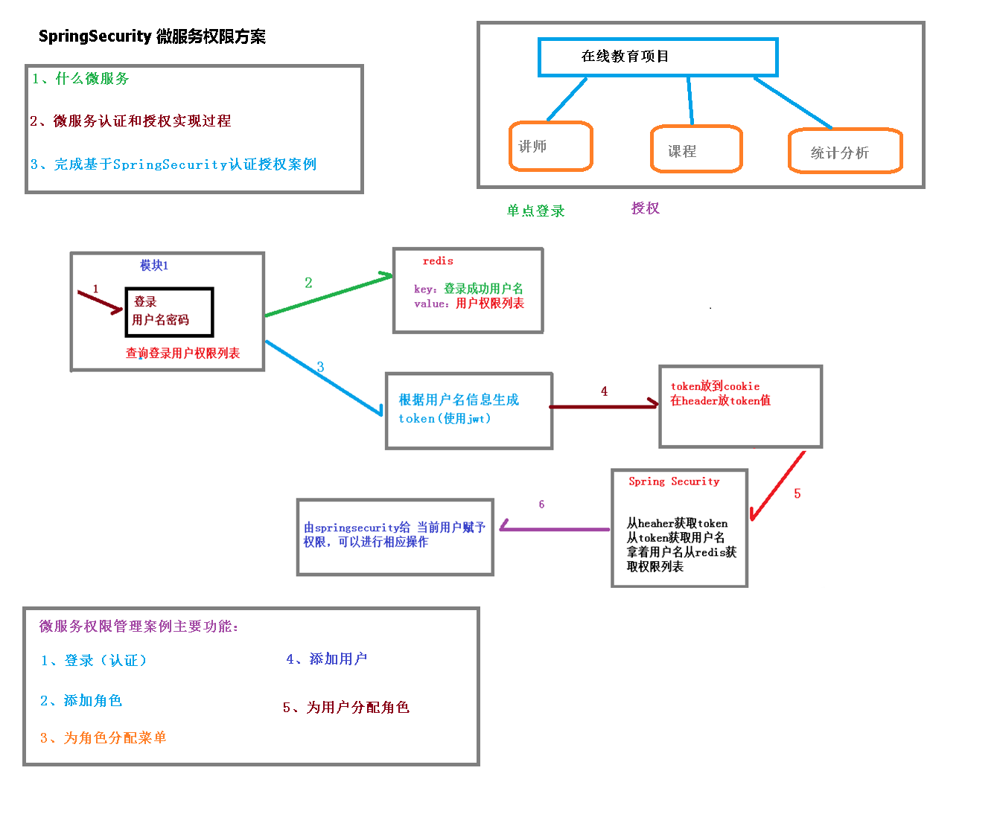
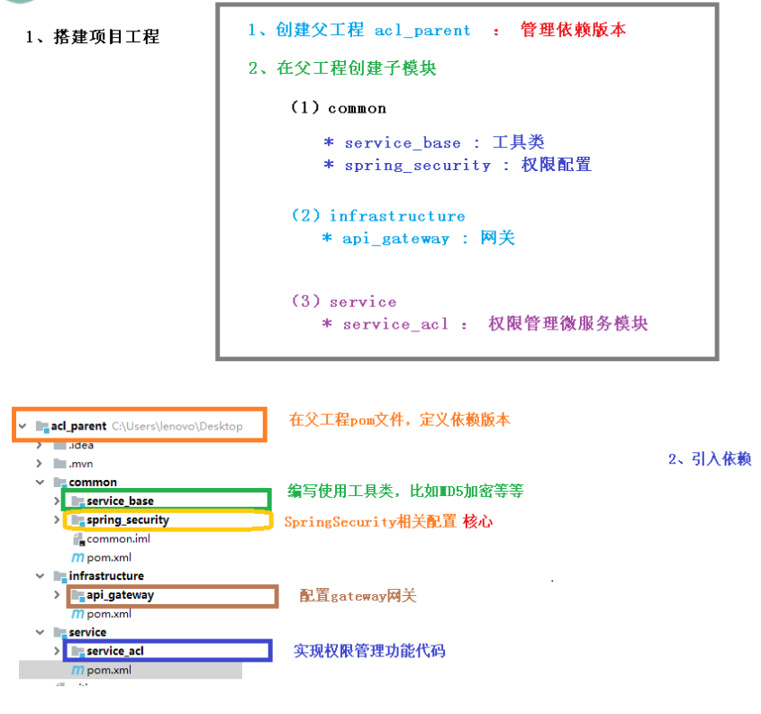

# SpringSecurity框架学习：

# 介绍(一)

> 系列知识点来源于尚硅谷教程：

## 1.1 概要
Spring 是非常流行和成功的 Java 应用开发框架，Spring Security 正是 Spring 家族中的
成员。Spring Security 基于 Spring 框架，提供了一套 Web 应用安全性的完整解决方
案。
正如你可能知道的关于安全方面的两个主要区域是“**认证**”和“**授权**”（或者访问控
制），一般来说，Web 应用的安全性包括用户认证（Authentication）和用户授权
（Authorization）两个部分，这两点也是Spring Security重要核心功能。
（1）用户认证指的是：验证某个用户是否为系统中的合法主体，也就是说用户能否访问
该系统。用户认证一般要求用户提供用户名和密码。系统通过校验用户名和密码来完成认
证过程。通俗点说就是系统认为用户是否能登录
（2）用户授权指的是验证某个用户是否有权限执行某个操作。在一个系统中，不同用户
所具有的权限是不同的。比如对一个文件来说，有的用户只能进行读取，而有的用户可以
进行修改。一般来说，系统会为不同的用户分配不同的角色，而每个角色则对应一系列的
权限。通俗点讲就是系统判断用户是否有权限去做某些事情。

## 1.2 历史
Spring Security 开始于 2003 年年底, “spring 的 acegi 安全系统”。 起因是 Spring开发者邮件列表中的一个问题,有人提问是否考虑提供一个基于 spring 的安全实现。
Spring Security 以“The Acegi Secutity System for Spring” 的名字始于 2013 年晚些时候。一个问题提交到 Spring 开发者的邮件列表，询问是否已经有考虑一个机遇 Spring的安全性社区实现。那时候 Spring 的社区相对较小（相对现在）。实际上 Spring 自己在2013年只是一个存在于 ScourseForge 的项目，这个问题的回答是一个值得研究的领域，虽然目前时间的缺乏组织了我们对它的探索。

考虑到这一点，一个简单的安全实现建成但是并没有发布。几周后，Spring 社区的其他成
员询问了安全性，这次这个代码被发送给他们。其他几个请求也跟随而来。到 2014 年一月大约有 20 万人使用了这个代码。这些创业者的人提出一个 SourceForge 项目加入是为了，这是在 2004 三月正式成立。

在早些时候，这个项目没有任何自己的验证模块，身份验证过程依赖于容器管理的安全性和 Acegi安全性。而不是专注于授权。开始的时候这很适合，但是越来越多的用户请求额外的容器支持。容器特定的认证领域接口的基本限制变得清晰。还有一个相关的问题增加新的容器的路径，这是最终用户的困惑和错误配置的常见问题。

Acegi 安全特定的认证服务介绍。大约一年后，Acegi 安全正式成为了 Spring 框架的子项目。1.0.0 最终版本是出版于 2006 -在超过两年半的大量生产的软件项目和数以百计的改进和积极利用社区的贡献。

Acegi安全2007年底正式成为了Spring组合项目，更名为"Spring Security"。


# 和shiro比较(二)

## SpringSecurity特点:
-  和Spring无缝整合
- 全面的权限控制
- 专门为web开发二设计

	旧版本不能脱离web环境使用
	新版本对整个框架进行了分层抽取，分成了核心模块和Web模块。单独引入核心模块就可以脱离Web环境
- 重量级

## Shiro
- Apache旗下的轻量级权限控制框架、
### 特点
- 轻量级。Shiro主张的理念是把复杂的事情变简单。针对对性能有更高要求的互联网应用有更好表现
### 通用性
- 好处：不局限于Web环境，可用脱离Web环境使用。
- 缺陷：在Web环境下一些特定的需求需要手动编写代码定制


Spring Security 是 Spring 家族中的一个安全管理框架，实际上，在 Spring Boot 出现之
前，Spring Security 就已经发展了多年了，但是使用的并不多，安全管理这个领域，一直是Shiro的天下。

相对于 Shiro，在 SSM 中整合 Spring Security 都是比较麻烦的操作，所以，SpringSecurity 虽然功能比 Shiro 强大，但是使用反而没有Shiro多（Shiro 虽然功能没有Spring Security 多，但是对于大部分项目而言，Shiro 也够用了 ) 。
自从有了 Spring Boot 之后，Spring Boot 对于Spring Security 提供了自动化配置方案，可以使用更少的配置来使用 Spring Security。

因此，一般来说，常见的安全管理技术栈的组合是这样的：
SSM + Shiro
Spring Boot/Spring Cloud + Spring Security
以上只是一个推荐的组合而已，如果单纯从技术上来说，无论怎么组合，都是可以运行
的。


# 权限管理中的相关概念(三)

## 主体
英文单词：principal
使用系统的用户或设备或从其他系统远程登录的用户等等。简单说就是谁使用系统谁就是主体。

##  认证
英文单词：authentication
权限管理系统确认一个主体的身份，允许主体进入系统。简单说就是“主体”证明自己是谁。
笼统的认为就是以前所做的登录操作。
## 授权
英文单词：authorization
将操作系统的“权力”“授予”“主体”，这样主体就具备了操作系统中特定功能的能力。
所以简单来说，授权就是给用户分配权限。


# 基本原理(四)

## SpringSecurity 本质是一个**过滤器**链：
从启动是可以获取到过滤器链：

```java
org.springframework.security.web.context.request.async.WebAsyncManagerIntegrationFilter
org.springframework.security.web.context.SecurityContextPersistenceFilter
org.springframework.security.web.header.HeaderWriterFilter
org.springframework.security.web.csrf.CsrfFilter
org.springframework.security.web.authentication.logout.LogoutFilter
org.springframework.security.web.authentication.UsernamePasswordAuthenticationFilter
org.springframework.security.web.authentication.ui.DefaultLoginPageGeneratingFilter
org.springframework.security.web.authentication.ui.DefaultLogoutPageGeneratingFilter
org.springframework.security.web.savedrequest.RequestCacheAwareFilter
org.springframework.security.web.servletapi.SecurityContextHolderAwareRequestFilter
org.springframework.security.web.authentication.AnonymousAuthenticationFilter
org.springframework.security.web.session.SessionManagementFilter
org.springframework.security.web.access.ExceptionTranslationFilter
org.springframework.security.web.access.intercept.FilterSecurityInterceptor
```


代码底层流程：重点看三个过滤器：
FilterSecurityInterceptor：是一个方法级的权限过滤器, 基本位于过滤链的最底部。

ExceptionTranslationFilter：是个异常过滤器，用来处理在认证过程中抛出的异常

UsernamePasswordAuthenticationFilter：对/login的POST请求做拦截，校验表单中用户名，密码。


# 用户认证 - 设置登录的用户名和密码(五)

### 准备：

### 版本信息
```xml
<parent>
        <groupId>org.springframework.boot</groupId>
        <artifactId>spring-boot-starter-parent</artifactId>
        <version>2.2.1.RELEASE</version>
        <relativePath/> <!-- lookup parent from repository -->
    </parent>
    <groupId>com.example</groupId>
    <artifactId>springsecuritydemo01</artifactId>
    <version>0.0.1-SNAPSHOT</version>
    <name>springsecuritydemo01</name>
    <description>springsecuritydemo01</description>
    <properties>
        <java.version>1.8</java.version>
    </properties>
```


### jar包
```xml
<dependency>
            <groupId>org.springframework.boot</groupId>
            <artifactId>spring-boot-starter-web</artifactId>
        </dependency>
        <dependency>
            <groupId>org.springframework.boot</groupId>
            <artifactId>spring-boot-starter-security</artifactId>
        </dependency>
```

### 控制层
```java
@RestController
@RequestMapping("/test")
public class TestController {

    @GetMapping("/hello")
    public String hello(){
        return "hello security";
    }
}

```


## 第一种：通过配置文件
```markdown
spring.security.user.name=test
spring.security.user.password=test
```


## 第二种：通过配置类

```java
@Configuration
public class SecurityConfig extends WebSecurityConfigurerAdapter {

    @Override
    protected void configure(AuthenticationManagerBuilder auth) throws Exception {

        BCryptPasswordEncoder passwordEncoder = new BCryptPasswordEncoder();
        String password = passwordEncoder.encode("test123");

        auth.inMemoryAuthentication().withUser("test").password(password).roles("admin");
    }

    @Bean
    PasswordEncoder passwordEncoder(){
        return new BCryptPasswordEncoder();
    }
}
```

## 第三种：自定义编写实现类

第一步 创建配置类，设置使用哪个userDetailService实现类
```java
@Configuration
public class SecurityConfigDiy extends WebSecurityConfigurerAdapter {

    @Autowired
    private UserDetailsService userDetailsService;

    @Override
    protected void configure(AuthenticationManagerBuilder auth) throws Exception{
        auth.userDetailsService(userDetailsService).passwordEncoder(passwordEncoder());
    }


    @Bean
    PasswordEncoder passwordEncoder(){
        return new BCryptPasswordEncoder();
    }
}

```


第二步 编写实现类，返回User对象，User对象有用户名密码和操作权限
```java
@Service("userDetailsService")
public class MyUserDetailService implements UserDetailsService {


    @Override
    public UserDetails loadUserByUsername(String username) throws UsernameNotFoundException {

        List<GrantedAuthority> authorityList = AuthorityUtils.commaSeparatedStringToAuthorityList("admin");


        return new User("test",new BCryptPasswordEncoder().encode("123"),authorityList);
    }
}
```


# 用户认证 - 查询数据库(六)

## 准备：

### sql数据
```sql
CREATE TABLE `users` (
  `id` int NOT NULL,
  `username` varchar(10) CHARACTER SET utf8 COLLATE utf8_general_ci DEFAULT NULL,
  `password` varchar(10) CHARACTER SET utf8 COLLATE utf8_general_ci DEFAULT NULL,
  PRIMARY KEY (`id`)
) ENGINE=InnoDB DEFAULT CHARSET=utf8mb3;
```
```sql
INSERT INTO `users` VALUES (1, 'lucy', '123');
INSERT INTO `users` VALUES (2, 'tom', '456');
```

### pom文件
```xml
<dependency>
            <groupId>org.springframework.boot</groupId>
            <artifactId>spring-boot-starter-web</artifactId>
        </dependency>
        <dependency>
            <groupId>org.springframework.boot</groupId>
            <artifactId>spring-boot-starter-security</artifactId>
        </dependency>
<!--        mybatis-plus-->
        <dependency>
            <groupId>com.baomidou</groupId>
            <artifactId>mybatis-plus-boot-starter</artifactId>
            <version>3.0.5</version>
        </dependency>
<!--        mysql-->
        <dependency>
            <groupId>mysql</groupId>
            <artifactId>mysql-connector-java</artifactId>
        </dependency>
<!--        lombok简化实体类-->
        <dependency>
            <groupId>org.projectlombok</groupId>
            <artifactId>lombok</artifactId>
        </dependency>
```

### properties配置文件
```markdown
spring.datasource.driver-class-name=com.mysql.cj.jdbc.Driver
spring.datasource.url=jdbc:mysql://localhost:3306/test?serverTimezone=GMT%2B8
spring.datasource.username=root
spring.datasource.password=root
```

### 实体类
```java
@Data
public class Users {

    private Integer id;
    private String username;
    private String password;

}

```

### mapper扫描
```java
@SpringBootApplication
@MapperScan("com.example.springsecuritydemo01.mapper")
public class Springsecuritydemo01Application {

    public static void main(String[] args) {
        SpringApplication.run(Springsecuritydemo01Application.class, args);
    }

}
```

## UsersMapper
添加@Repository注解防止@Autowired注入时飘红，可不加
```java
@Repository
public interface UsersMapper extends BaseMapper<Users> {

}
```

## 配置类
```java
@Configuration
public class SecurityConfigDiy extends WebSecurityConfigurerAdapter {

    @Autowired
    private UserDetailsService userDetailsService;

    @Override
    protected void configure(AuthenticationManagerBuilder auth) throws Exception{
        auth.userDetailsService(userDetailsService).passwordEncoder(passwordEncoder());
    }


    @Bean
    PasswordEncoder passwordEncoder(){
        return new BCryptPasswordEncoder();
    }
}
```


## 测试Controller
```java
@RestController
@RequestMapping("/test")
public class TestController {

    @GetMapping("/hello")
    public String hello(){
        return "hello security";
    }
}
```

## MyUserDetailService

```java
@Service("userDetailsService")
public class MyUserDetailService implements UserDetailsService {

    @Autowired
    private UsersMapper usersMapper;

    @Override
    public UserDetails loadUserByUsername(String username) throws UsernameNotFoundException {

        QueryWrapper<Users> wrapper = new QueryWrapper<>();
        wrapper.eq("username",username);
        Users users = usersMapper.selectOne(wrapper);
        if(users == null){
            throw new UsernameNotFoundException("用户名不存在!");
        }
        List<GrantedAuthority> authorityList = AuthorityUtils.commaSeparatedStringToAuthorityList("admin");

        return new User(users.getUsername(),new BCryptPasswordEncoder().encode(users.getPassword()),authorityList);
    }
}
```


# 用户认证 -自定义登录页面(七)

## 配置类
```java
@Configuration
public class SecurityConfigDiy extends WebSecurityConfigurerAdapter {

    @Autowired
    private UserDetailsService userDetailsService;

    @Override
    protected void configure(AuthenticationManagerBuilder auth) throws Exception{
        auth.userDetailsService(userDetailsService).passwordEncoder(passwordEncoder());
    }


    @Bean
    PasswordEncoder passwordEncoder(){
        return new BCryptPasswordEncoder();
    }

    @Override
    protected void configure(HttpSecurity httpSecurity) throws Exception{

        httpSecurity.formLogin()    //自定义自己编写的登录页面
                .loginPage("/login.html")    //登录页面设置
                .loginProcessingUrl("/user/login")  //登录访问路径 按登录按钮后跳转路径
                .defaultSuccessUrl("/test/index").permitAll()   //登录成功之后,跳转路径
                .and().authorizeRequests()
                .antMatchers("/","/test/hello","/user/login").permitAll()   //设置可以直接访问的路径
                .anyRequest().authenticated()
                .and().csrf().disable();    //关闭csrf防护

    }
}
```

## 页面
路径：/resources/static/login.html
强制要求name名称：
name="username"
name="password"

```html
<!DOCTYPE html>
<html lang="en">
<head>
    <meta charset="UTF-8">
    <title>登录</title>
</head>
<body>
        <form action="/user/login" method="post" >
            用户名：<input type="text" name="username">
            <br/>
            密码：<input type="text" name="password">
            <br/>
            <input type="submit" value="登录">
        </form>
</body>
</html>
```


## 控制层
```java
@RestController
@RequestMapping("/test")
public class TestController {

    @GetMapping("/hello")
    public String hello(){
        return "hello security";
    }

    @GetMapping("/index")
    public String index(){
        return "hello index";
    }
}
```

通过页面post传递过来的用户名密码
和根据用户名查询出来的用户名密码 比较

## 源码比较密码的地方


# 用户授权-基于角色或权限进行访问控制(八)

## 权限：hasAuthority


## 权限：hasAnyAuthority


## 角色：hasRole


## 角色：hasAnyRole
如果有多个角色 满足其中一个即可以访问


## 代码
```java
@Override
    protected void configure(HttpSecurity httpSecurity) throws Exception{

        httpSecurity.formLogin()    //自定义自己编写的登录页面
                .loginPage("/login.html")    //登录页面设置
                .loginProcessingUrl("/user/login")  //登录访问路径 按登录按钮后跳转路径
                .defaultSuccessUrl("/test/index").permitAll()   //登录成功之后,跳转路径
                .and().authorizeRequests()
                .antMatchers("/","/test/hello","/user/login").permitAll()   //设置可以直接访问的路径
                //1.hasAuthority方法
                //.antMatchers("/test/index").hasAuthority("admins")
                //2.hasAnyAuthority方法
                //.antMatchers("/test/index").hasAnyAuthority("admins","query")
                //3.hasRole方法 ROLE_sale
                //.antMatchers("/test/index").hasRole("sale")
                //4.hasAnyRole ROLE_admin
                .antMatchers("/test/index").hasAnyRole("admin")
                .anyRequest().authenticated()
                .and().csrf().disable();    //关闭csrf防护

    }
```


## 没有权限：自定义403页面
```java
httpSecurity.exceptionHandling().accessDeniedPage("/unauth.html");
```


# 认证授权注解使用(九)

## @Secured注解
判断是否拥有角色

```java
 @GetMapping("/update")
    //拥有其中一个角色才能访问
    @Secured({"ROLE_sale","ROLE_manager"})
    public String update(){
        return "hello update!";
    }
```

## @PreAuthorize注解
进入方法前进行验证，可以是角色或者权限

```java
@GetMapping("/update")
    //拥有其中一个角色才能访问
    //@Secured({"ROLE_sale","ROLE_manager"})
    //进入方法前做验证 可以时角色或者 权限 hasAnyRole hasAnyAuthority
    @PreAuthorize("hasAnyAuthority('admins')")
    public String update(){
        return "hello update!";
    }
```

##  @PostAuthorize注解
方法执行后进行权限验证

```java
@GetMapping("/update")
    //拥有其中一个角色才能访问
    //@Secured({"ROLE_sale","ROLE_manager"})
    //进入方法前做验证 可以时角色或者 权限 hasAnyRole hasAnyAuthority
    //@PreAuthorize("hasAnyAuthority('admins')")
    //执行完方法 返回时验证
    @PostAuthorize("hasAnyAuthority('admin')")
    public String update(){
        System.out.println("update...");
        return "hello update!";
    }
```


## @PostFilter注解
## @PreFilter注解


# 用户注销(十)

```java
//退出
        httpSecurity.logout().logoutUrl("/logout")  //退出路径
                        .logoutSuccessUrl("/test/hello")    //退出成功的路径
                        .permitAll();
```


# 自动登录-记住我(十一)

## 源码实现
RememberMeServices
JdbcTokenRepositoryImpl


## 技术实现


## SQL记录表
```sql
CREATE TABLE `persistent_logins` (
  `username` varchar(64) NOT NULL,
  `series` varchar(64) NOT NULL,
  `token` varchar(64) NOT NULL,
  `last_used` timestamp NOT NULL,
  PRIMARY KEY (`series`)
) ENGINE=InnoDB DEFAULT CHARSET=utf8mb3;
```


## 页面：
```html
<!DOCTYPE html>
<html lang="en">
<head>
    <meta charset="UTF-8">
    <title>登录</title>
</head>
<body>
        <form action="/user/login" method="post" >
            用户名：<input type="text" name="username">
            <br/>
            密码：<input type="text" name="password">
            <br/>
            <input type="checkbox" name="remember-me">自动登录
            <br/>
            <input type="submit" value="登录">
            <br/>

        </form>
</body>
</html>
```


## 配置类
```java
package com.example.springsecuritydemo01.config;

import org.springframework.beans.factory.annotation.Autowired;
import org.springframework.context.annotation.Bean;
import org.springframework.context.annotation.Configuration;
import org.springframework.security.config.annotation.authentication.builders.AuthenticationManagerBuilder;
import org.springframework.security.config.annotation.web.builders.HttpSecurity;
import org.springframework.security.config.annotation.web.configuration.WebSecurityConfigurerAdapter;
import org.springframework.security.core.userdetails.UserDetailsService;
import org.springframework.security.crypto.bcrypt.BCryptPasswordEncoder;
import org.springframework.security.crypto.password.PasswordEncoder;
import org.springframework.security.web.authentication.rememberme.JdbcTokenRepositoryImpl;
import org.springframework.security.web.authentication.rememberme.PersistentTokenRepository;

import javax.sql.DataSource;


@Configuration
public class SecurityConfigDiy extends WebSecurityConfigurerAdapter {

    @Autowired
    private UserDetailsService userDetailsService;

    @Autowired
    private DataSource dataSource;

    @Bean
    public PersistentTokenRepository persistentTokenRepository(){
        JdbcTokenRepositoryImpl jdbcTokenRepository = new JdbcTokenRepositoryImpl();
        jdbcTokenRepository.setDataSource(dataSource);
        //自动创建自动登录信息记录表
//        jdbcTokenRepository.setCreateTableOnStartup(true);
        return jdbcTokenRepository;
    }


    @Override
    protected void configure(AuthenticationManagerBuilder auth) throws Exception{
        auth.userDetailsService(userDetailsService).passwordEncoder(passwordEncoder());
    }


    @Bean
    PasswordEncoder passwordEncoder(){
        return new BCryptPasswordEncoder();
    }

    @Override
    protected void configure(HttpSecurity httpSecurity) throws Exception{

        //退出
        httpSecurity.logout().logoutUrl("/logout")  //退出路径
                        .logoutSuccessUrl("/test/hello")    //退出成功的路径
                        .permitAll();

        httpSecurity.exceptionHandling().accessDeniedPage("/unauth.html");

        httpSecurity.formLogin()    //自定义自己编写的登录页面
                .loginPage("/login.html")    //登录页面设置
                .loginProcessingUrl("/user/login")  //登录访问路径 按登录按钮后跳转路径
                .defaultSuccessUrl("/success.html").permitAll()   //登录成功之后,跳转路径
                .and().authorizeRequests()
                .antMatchers("/","/test/hello","/user/login").permitAll()   //设置可以直接访问的路径
                //1.hasAuthority方法
                //.antMatchers("/test/index").hasAuthority("admins")
                //2.hasAnyAuthority方法
                //.antMatchers("/test/index").hasAnyAuthority("admins","query")
                //3.hasRole方法 ROLE_sale
                //.antMatchers("/test/index").hasRole("sale")
                //4.hasAnyRole ROLE_admin
                .antMatchers("/test/index").hasAnyRole("admin22")
                .anyRequest().authenticated()

                .and().rememberMe().tokenRepository(persistentTokenRepository())
                .tokenValiditySeconds(60*60)//设置有效时长 单位 秒
                .userDetailsService(userDetailsService)

                .and().csrf().disable();    //关闭csrf防护

    }
}

```


# CSRF-跨站请求伪造(十二)

## 概念
跨站请求伪造（英语：Cross-site request forgery),也被称为one-clickattack或者session riding,通常缩写为CSRF或若XSRF,是一种挟制用户在当前已登录的Web应用程序上执行非本意的操作的攻击方法。跟跨网站脚本(XSS)相比，XSS利用的是用户对指定网站的信任，CSRF利用的是网站对用户网页浏览器的信任。
跨站请求攻击，简单地说，是攻击者通过一些技术手段欺骗用户的浏览器去访问一个自己曾经认证过的网站并运行一些操作（如发邮件，发消息，甚至财产操作如转账和购买商品)。由于浏览器曾经认证过，所以被访问的网站会认为是真正的用户操作而去运行。这利用了web中用户身份验证的一个漏洞：简单的身份验证只能保证请求发自某个用户的浏览器，却不能保证请求本身是用户自愿发出的。
从Spring Security4.0开始，默认情况下会启用CSRF保护，以防止CSRF攻击应用程序，Spring Security CSRF会针对PATCH,POST,PUT和DELETE方法进行防护。


## SpringSecurity的CSRF实现


1.生成csrfToken保存到HttpSession或Cookie中。


2.请求到来时，从请求中提取cstfToken，和保存的csrfToken做比较，进而判断当前请求是否合法。主要通过CsrfFilter过滤器来完成。


## 代码实现
```html
 <input type="hidden" th:name="${_csrf.parameterName}" th:value="${_csrf.token}"/>
```

```java
//关闭csrf保护功能
        //http.csrf().disable();
```


# 微服务权限方案(十三)

## 图解


## 认证授权过程分析
(1)如果是基于Session,那么Spring-security会对cookie里的sessionid进行解析，找到服务器存储的session信息，然后判断当前用户是否符合请求的要求。
(2)如果是token,则是解析出token,然后将当前请求加入到Spring-security管理的权限信息中去

如果系统的模块众多，每个模块都需要进行授权与认证，所以我们选择基于token的形式进行授权与认证，用户根据用户名密码认证成功，然后获取当前用户角色的一系列权限值，并以用户名为key,权限列表value的形式存入redis缓存中，根据用户名相关信息生成token返回，浏览器将token记录到cookie中，每次调用api接口都默认将token携带到header请求头中，Spring-security解析header头获取token信息，解析token获取当前用户名，根据用户名就可以从redis中获取权限列表，这样Spring-security就能够判断当前请求是否有权限访问


## 权限数据模型


## 项目结构



# 微服务关键代码(十四)

项目地址：https://github.com/fangyishui/SpringSecurityCode


### TokenWebSecurityConfig
```java
package com.security.config;

import com.security.filter.TokenAuthFilter;
import com.security.filter.TokenLoginFilter;
import com.security.security.DefaultPasswordEncoder;
import com.security.security.TokenLogoutHandler;
import com.security.security.TokenManager;
import com.security.security.UnauthEntryPoint;
import org.springframework.beans.factory.annotation.Autowired;
import org.springframework.context.annotation.Configuration;
import org.springframework.data.redis.core.RedisTemplate;
import org.springframework.security.config.annotation.authentication.builders.AuthenticationManagerBuilder;
import org.springframework.security.config.annotation.method.configuration.EnableGlobalMethodSecurity;
import org.springframework.security.config.annotation.web.builders.HttpSecurity;
import org.springframework.security.config.annotation.web.builders.WebSecurity;
import org.springframework.security.config.annotation.web.configuration.EnableWebSecurity;
import org.springframework.security.config.annotation.web.configuration.WebSecurityConfigurerAdapter;
import org.springframework.security.core.userdetails.UserDetailsService;

@Configuration
@EnableWebSecurity
@EnableGlobalMethodSecurity(prePostEnabled = true)
public class TokenWebSecurityConfig extends WebSecurityConfigurerAdapter {

    private TokenManager tokenManager;
    private RedisTemplate redisTemplate;
    private DefaultPasswordEncoder defaultPasswordEncoder;
    private UserDetailsService userDetailsService;

    @Autowired
    public TokenWebSecurityConfig(UserDetailsService userDetailsService, DefaultPasswordEncoder defaultPasswordEncoder,
                                  TokenManager tokenManager, RedisTemplate redisTemplate) {
        this.userDetailsService = userDetailsService;
        this.defaultPasswordEncoder = defaultPasswordEncoder;
        this.tokenManager = tokenManager;
        this.redisTemplate = redisTemplate;
    }

    /**
     * 配置设置
     * @param http
     * @throws Exception
     */
    //设置退出的地址和token，redis操作地址
    @Override
    protected void configure(HttpSecurity http) throws Exception {
        http.exceptionHandling()
                .authenticationEntryPoint(new UnauthEntryPoint())//没有权限访问
                .and().csrf().disable()
                .authorizeRequests()
                .anyRequest().authenticated()
                .and().logout().logoutUrl("/admin/acl/index/logout")//退出路径
                .addLogoutHandler(new TokenLogoutHandler(tokenManager,redisTemplate)).and()
                .addFilter(new TokenLoginFilter(authenticationManager(), tokenManager, redisTemplate))
                .addFilter(new TokenAuthFilter(authenticationManager(), tokenManager, redisTemplate)).httpBasic();
    }

    //调用userDetailsService和密码处理
    @Override
    public void configure(AuthenticationManagerBuilder auth) throws Exception {
        auth.userDetailsService(userDetailsService).passwordEncoder(defaultPasswordEncoder);
    }
    //不进行认证的路径，可以直接访问
    @Override
    public void configure(WebSecurity web) throws Exception {
        web.ignoring().antMatchers("/api/**");
    }
}

```
### TokenAuthFilter
```java
package com.security.filter;

import com.security.security.TokenManager;
import org.springframework.data.redis.core.RedisTemplate;
import org.springframework.security.authentication.AuthenticationManager;
import org.springframework.security.authentication.UsernamePasswordAuthenticationToken;
import org.springframework.security.core.GrantedAuthority;
import org.springframework.security.core.authority.SimpleGrantedAuthority;
import org.springframework.security.core.context.SecurityContextHolder;
import org.springframework.security.web.authentication.www.BasicAuthenticationFilter;

import javax.servlet.FilterChain;
import javax.servlet.ServletException;
import javax.servlet.http.HttpServletRequest;
import javax.servlet.http.HttpServletResponse;
import java.io.IOException;
import java.util.ArrayList;
import java.util.Collection;
import java.util.List;

public class TokenAuthFilter extends BasicAuthenticationFilter {

    private TokenManager tokenManager;
    private RedisTemplate redisTemplate;
    public TokenAuthFilter(AuthenticationManager authenticationManager,TokenManager tokenManager,RedisTemplate redisTemplate) {
        super(authenticationManager);
        this.tokenManager = tokenManager;
        this.redisTemplate = redisTemplate;
    }

    @Override
    protected void doFilterInternal(HttpServletRequest request, HttpServletResponse response, FilterChain chain) throws IOException, ServletException {
        //获取当前认证成功用户权限信息
        UsernamePasswordAuthenticationToken authRequest = getAuthentication(request);
        //判断如果有权限信息，放到权限上下文中
        if(authRequest != null) {
            SecurityContextHolder.getContext().setAuthentication(authRequest);
        }
        chain.doFilter(request,response);
    }

    private UsernamePasswordAuthenticationToken getAuthentication(HttpServletRequest request) {
        //从header获取token
        String token = request.getHeader("token");
        if(token != null) {
            //从token获取用户名
            String username = tokenManager.getUserInfoFromToken(token);
            //从redis获取对应权限列表
            List<String> permissionValueList = (List<String>)redisTemplate.opsForValue().get(username);
            Collection<GrantedAuthority> authority = new ArrayList<>();
            for(String permissionValue : permissionValueList) {
                SimpleGrantedAuthority auth = new SimpleGrantedAuthority(permissionValue);
                authority.add(auth);
            }
            return new UsernamePasswordAuthenticationToken(username,token,authority);
        }
        return null;
    }

}

```

### TokenLoginFilter
```java
package com.security.filter;

import com.fasterxml.jackson.databind.ObjectMapper;
import com.security.entity.SecurityUser;
import com.security.entity.User;
import com.security.security.TokenManager;
import com.springsecurity.utils.utils.R;
import com.springsecurity.utils.utils.ResponseUtil;
import org.springframework.data.redis.core.RedisTemplate;
import org.springframework.security.authentication.AuthenticationManager;
import org.springframework.security.authentication.UsernamePasswordAuthenticationToken;
import org.springframework.security.core.Authentication;
import org.springframework.security.core.AuthenticationException;
import org.springframework.security.core.context.SecurityContextHolder;
import org.springframework.security.web.authentication.UsernamePasswordAuthenticationFilter;
import org.springframework.security.web.util.matcher.AntPathRequestMatcher;

import javax.servlet.FilterChain;
import javax.servlet.ServletException;
import javax.servlet.http.HttpServletRequest;
import javax.servlet.http.HttpServletResponse;
import java.io.IOException;
import java.util.ArrayList;

public class TokenLoginFilter extends UsernamePasswordAuthenticationFilter {

    private TokenManager tokenManager;
    private RedisTemplate redisTemplate;
    private AuthenticationManager authenticationManager;

    public TokenLoginFilter(AuthenticationManager authenticationManager, TokenManager tokenManager, RedisTemplate redisTemplate) {
        this.authenticationManager = authenticationManager;
        this.tokenManager = tokenManager;
        this.redisTemplate = redisTemplate;
        this.setPostOnly(false);
        this.setRequiresAuthenticationRequestMatcher(new AntPathRequestMatcher("/admin/acl/login","POST"));
    }

    //1 获取表单提交用户名和密码
    @Override
    public Authentication attemptAuthentication(HttpServletRequest request, HttpServletResponse response)
            throws AuthenticationException {
        //获取表单提交数据
        try {
            User user = new ObjectMapper().readValue(request.getInputStream(), User.class);
            return authenticationManager.authenticate(new UsernamePasswordAuthenticationToken(user.getUsername(),user.getPassword(),
                    new ArrayList<>()));
        } catch (IOException e) {
            e.printStackTrace();
            throw new RuntimeException();
        }
    }

    //2 认证成功调用的方法
    @Override
    protected void successfulAuthentication(HttpServletRequest request, 
                                            HttpServletResponse response, FilterChain chain, Authentication authResult)
            throws IOException, ServletException {
        //认证成功，得到认证成功之后用户信息
        SecurityUser user = (SecurityUser)authResult.getPrincipal();
        //根据用户名生成token
        String token = tokenManager.createToken(user.getCurrentUserInfo().getUsername());
        //把用户名称和用户权限列表放到redis
        redisTemplate.opsForValue().set(user.getCurrentUserInfo().getUsername(),user.getPermissionValueList());
        //返回token
        ResponseUtil.out(response, R.ok().data("token",token));
    }

    //3 认证失败调用的方法
    protected void unsuccessfulAuthentication(HttpServletRequest request, HttpServletResponse response, AuthenticationException failed)
            throws IOException, ServletException {
        ResponseUtil.out(response, R.error());
    }
}

```

### TokenLogoutHandler
```java
package com.security.security;

import com.springsecurity.utils.utils.R;
import com.springsecurity.utils.utils.ResponseUtil;
import org.springframework.data.redis.core.RedisTemplate;
import org.springframework.security.core.Authentication;
import org.springframework.security.web.authentication.logout.LogoutHandler;

import javax.servlet.http.HttpServletRequest;
import javax.servlet.http.HttpServletResponse;
//退出处理器
public class TokenLogoutHandler implements LogoutHandler {
    private TokenManager tokenManager;
    private RedisTemplate redisTemplate;

    public TokenLogoutHandler(TokenManager tokenManager,RedisTemplate redisTemplate) {
        this.tokenManager = tokenManager;
        this.redisTemplate = redisTemplate;
    }
    @Override
    public void logout(HttpServletRequest request, HttpServletResponse response, Authentication authentication) {
        //1 从header里面获取token
        //2 token不为空，移除token，从redis删除token
        String token = request.getHeader("token");
        if(token != null) {
            //移除
            tokenManager.removeToken(token);
            //从token获取用户名
            String username = tokenManager.getUserInfoFromToken(token);
            redisTemplate.delete(username);
        }
        ResponseUtil.out(response, R.ok());
    }
}

```


# 原理总结(十五)

## SpringSecurity的过滤器介绍
SpringSecurity采用的是责任链的设计模式，它有一条很长的过滤器链。现在对这条过滤器链的15个过滤器进行说明：
(1)WebAsyncManagerIntegrationFilter:将Security上下文与Spring Web中用于处理异步请求映射的WebAsyncManager进行集成。
(2)SecurityContextPersistenceFilter:在每次请求处理之前将该请求相关的安全上下文信息加载到SecurityContextHolder中，然后在该次请求处理完成之后，将SecurityContextHolder中关于这次请求的信息存储到一个“仓储”中，然后将SecurityContextHolder中的信息清除，例如在Session中维护一个用户的安全信息就是这个过滤器处理的。
(3)HeaderWriterFilter:用于将头信息加入响应中。
(4)CsrfFilter:用于处理跨站请求伪造。
(5)LogoutFi1ter:用于处理退出登录
(6)UsernamePasswordAuthenticationFilter:用于处理基于表单的登录请求，从表单中获取用户名和密码。默认情况下处理来自/1ogin的请求。从表单中获取用户名和密码时，默认使用的表单name值为username和password,这两个值可以通过设置这个
过滤器的usernameParameter和passwordParameter两个参数的值进行修改.
(7)DefaultLoginPageGeneratingFilter:如果没有配置登录页面，那系统初始化时就会配置这个过滤器，并且用于在需要进行登录时生成一个登录表单页面。
(8)BasicAuthenticationFilter:检测和处理http basic认证.
(9)RequestCacheAwareFilter:用来处理请求的缓存.
(10)SecurityContextHlolderAwareRequestFilter:主要是包装请求对象request.
(11)AnonymousAuthenticationFilter:检securityContextHolder中是否存在
Authentication对象，如果不存在为其提供一个匿名Authentication.
(12)SessionManagementFilter:管理session的过滤器
(l3)ExceptionTranslationFilter:处理AccessDeniedException和AuthenticationException异常.。
(l4)FilterSecurityInterceptor:可以看做过滤器链的出口.
(l5)RememberMeAuthenticationFilter:当用户设有登录而直接访问资源时，从cookie里找出用户的信息，如果Spring Security能够识别出用户提供的remember me cookie,用户将不必填写用户名和密码，而是直接登录进入系统，该过滤器默认不开启。

## Spring Security基本流程
## 认证流程


## 权限访问流程


## 认证流程中各核心类和接口的关系图


## SpringSecurity原理-请求间共享认证信息
